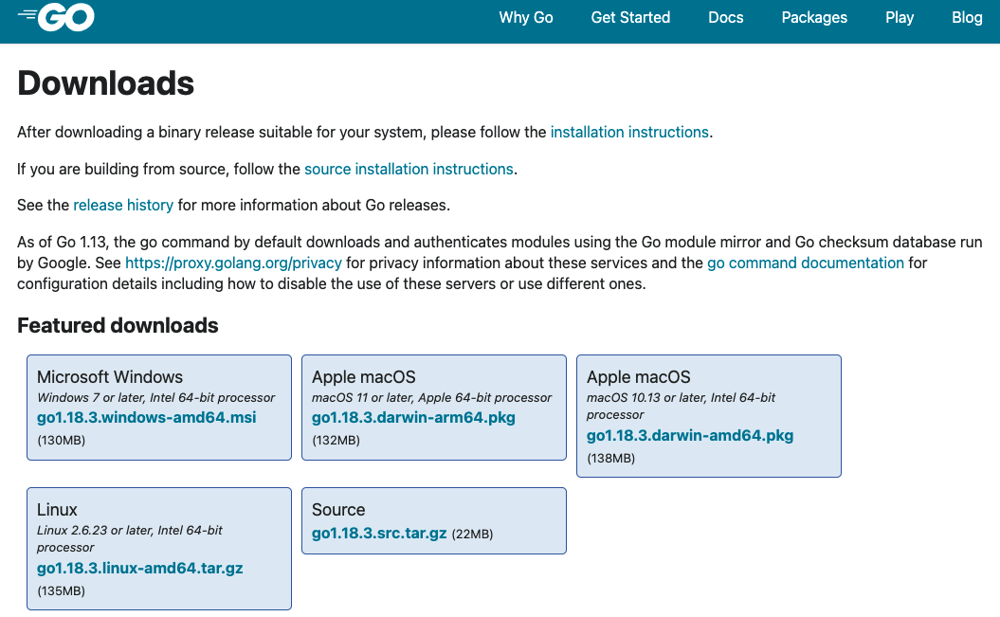
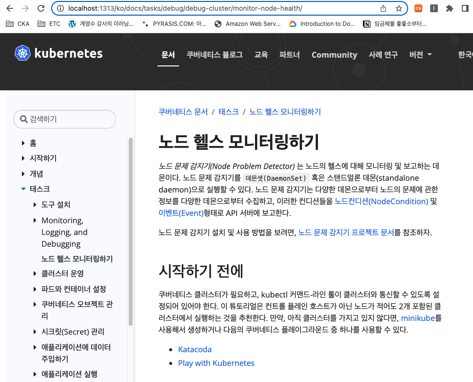

올해 7월 9일(토)부터 2022년도 오픈소스 컨트리뷰션 아카데미 중 “Kubernetes 한글화 컨트리뷰션 및 커뮤니티 참여” 프로젝트에 참가하게 되었다. 그 중 첫번째 과제는 [kubernetes.slack.com](http://kubernetes.slack.com) 가입한 뒤 쿠버네티스 한글화 프로젝트와 관련된 `#kubernetes-docs-ko` , `#sig-docs` , `#sig-docs-localizations` 세 채널에 참여하는 것, 그리고 두 번째 과제가 [README](https://github.com/kubernetes/website/blob/main/README-ko.md)를 읽고 `kubernetes/website`를 빌드해보는 것이다.

<br/>

위의 Readme 문서를 살펴보면 로컬/컨테이너 환경에서 빌드하는 방법에 대해 설명되어있는데, 나는 로컬 빌드로 진행해보았다.

<br/><br/>

# 1. Hugo란?

쿠버네티스의 공식문서는 Hugo(확장 버전)라는 정적 사이트 생성기(Static Site Generator)를 이용해 만들어졌다. Hugo는 Jekyll, Hexo등과 마찬가지로 정적 웹사이트를 쉽게 만들 수 있게 해주는 생성기로, Go로 쓰여졌다(깃허브 블로그에 가장 많이 사용되는 Jekyll은 Ruby로 쓰여). 찾아보니 Hugo는 다른 정적 사이트 생성기에 비해 반응속도가 빨라, 블로그를 빠르게 배포할 수 있는 것이 장점이며, 점점 사용자가 늘어나는 추세라고 한다.

<br/><br/>

# 2. **Hugo를 사용하여 로컬에서 웹사이트 실행하기**

## 0. 사전 준비 사항

*참고: 아래 설치과정은 MacOS Monterey 12.4 버전 기준으로 진행하였다.* 

`kubernetes/website` 저장소를 로컬로 clone하기 전, 아래의 소프트웨어를 설치해준다.

- [npm](https://www.npmjs.com/)
- [Go](https://go.dev/)
- [Hugo](https://gohugo.io/)
- [도커](https://www.docker.com/) 등의 컨테이너 런타임(컨테이너 환경을 사용하지 않는다면 다운로드 하지 않아도 된다.)

<br/>

- 먼저 npm(Node Packaged Manager)의 경우 `npm ci` 명령어로 의존성 파일들을 다운로드 해준다(`sudo` 사용).

```bash
npm WARN prepare removing existing node_modules/ before installation

> core-js-pure@3.6.5 postinstall /Users/jinipark/Downloads/oss/k8s-translation/website/node_modules/core-js-pure
> node -e "try{require('./postinstall')}catch(e){}"

Thank you for using core-js ( https://github.com/zloirock/core-js ) for polyfilling JavaScript standard library!

The project needs your help! Please consider supporting of core-js on Open Collective or Patreon:
> https://opencollective.com/core-js
> https://www.patreon.com/zloirock

Also, the author of core-js ( https://github.com/zloirock ) is looking for a good job -)

added 120 packages in 5.009s

   ╭────────────────────────────────────────────────────────────────╮
   │                                                                │
   │      New major version of npm available! 6.14.15 → 8.13.2      │
   │   Changelog: https://github.com/npm/cli/releases/tag/v8.13.2   │
   │               Run npm install -g npm to update!                │
   │                                                                │
   ╰────────────────────────────────────────────────────────────────╯
```

<br/>

- [Go](https://go.dev/) 웹사이트에 접속해 운영체제에 맞는 패키지 파일을 다운로드 받아 설치한다.
    
    
    
<br/>

- [Hugo 웹사이트의 Quick-Start페이지](https://gohugo.io/getting-started/quick-start/)의 설치 명령어를 참고해 Hugo를 설치한다.

```bash
brew install hugo
# or
port install hugo
```

<br/>

- 쿠버네티스 웹사이트 저장소를 clone한다(나의 경우 이미 한글화 작업을 진행하려고 내 저장소로 fork한 뒤 clone받아둔 것이 있어서 다시 clone하지 않고 해당 폴더에서 바로 작업하였다).

```bash
git clone https://github.com/kubernetes/website.git
cd website
```

<br/>

- 쿠버네티스 웹사이트는 [Docsy Hugo 테마](https://github.com/google/docsy#readme)를 사용한다. 다음을 실행하여 하위 모듈 및 기타 개발 종속성을 가져오자(웹사이트를 컨테이너에서 실행하려는 경우에도 마찬가지로 진행).

```bash
# Docsy 하위 모듈 가져오기
git submodule update --init --recursive --depth 1
```

<br/><br/>

## 1. 로컬에서 Hugo 웹 사이트 실행하기

- `make serve` 명령어를 통해 Hugo 웹 사이트를 실행해준다.

```bash
make serve
```

<br/><br/>

### MacOS에서 발생하는 에러 해결: make: *** [serve] Error 2

- `make serve` 를 실행하니 아래와 같이 에러가 발생했다.

```bash
...(생략)...
make: *** [serve] Error 2
```

- [README 파일에 기재된 이슈](https://github.com/kubernetes/website/blob/main/README-ko.md#too-many-open-files-%EC%9D%B4%EC%8A%88%EC%97%90-%EB%8C%80%ED%95%9C-macos-%EB%AC%B8%EC%A0%9C-%ED%95%B4%EA%B2%B0)와 관련이 있는 듯해 적혀져 있는 명령어를 따라해봤지만 문제가 해결되지 않았다.

<br/>

- 구글링을 해보니, `too many files open` 이슈에 대해 [다른 해결 방법](https://github.com/google/docsy-example/issues/89)을 제시한 사람이 있어 따라해보았다.

```bash
sudo launchctl limit maxfiles 65535 200000
ulimit -n 65535
sudo sysctl -w kern.maxfiles=100000
sudo sysctl -w kern.maxfilesperproc=65535
```

<br/>

- 다시 `make serve` 를 실행하니 Hugo가 문제 없이 실행되었다.

```bash
...(생략)...
Built in 41554 ms
Watching for changes in /Users/jinipark/Downloads/oss/k8s-translation/website/{archetypes,assets,content,data,i18n,layouts,package.json,postcss.config.js,static,themes}
Watching for config changes in /Users/jinipark/Downloads/oss/k8s-translation/website/config.toml, /Users/jinipark/Downloads/oss/k8s-translation/website/themes/docsy/config.toml, /Users/jinipark/Downloads/oss/k8s-translation/website/go.mod
Environment: "development"
Serving pages from memory
Running in Fast Render Mode. For full rebuilds on change: hugo server --disableFastRender
Web Server is available at http://localhost:1313/ (bind address 127.0.0.1)
Press Ctrl+C to stop
```

<br/>

- 브라우저에 `http://localhost:1313` 을 입력하여 내가 작업한 부분이 실제로 어떻게 표시되는지 로컬에서 확인해볼 수 있다.
    
    
