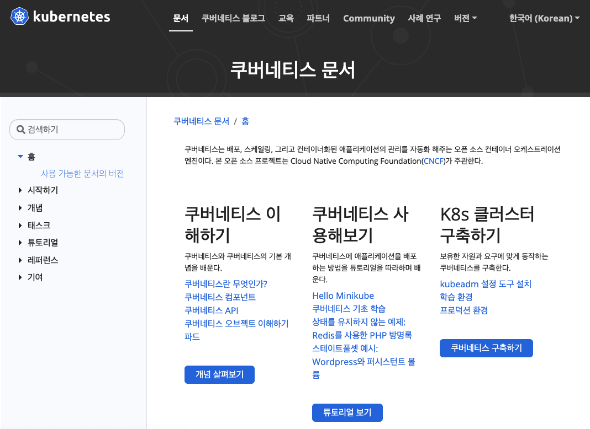
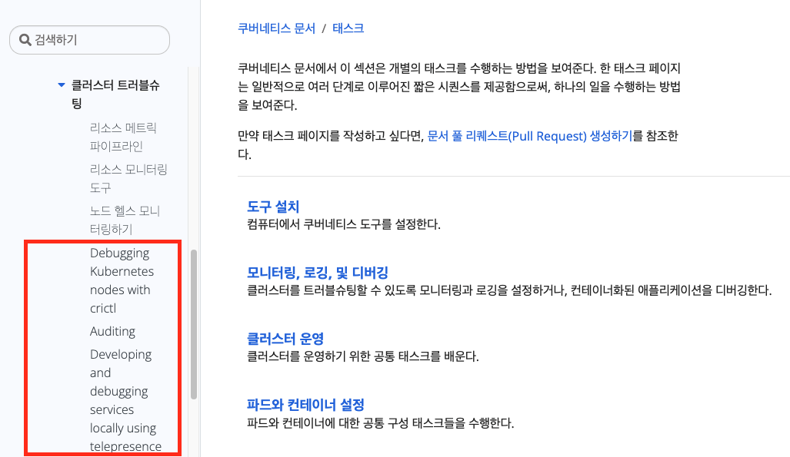
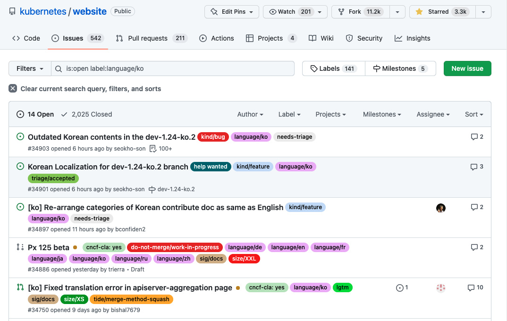
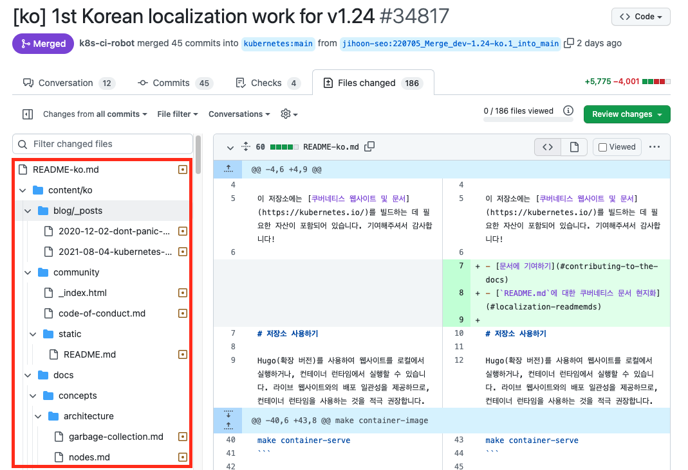
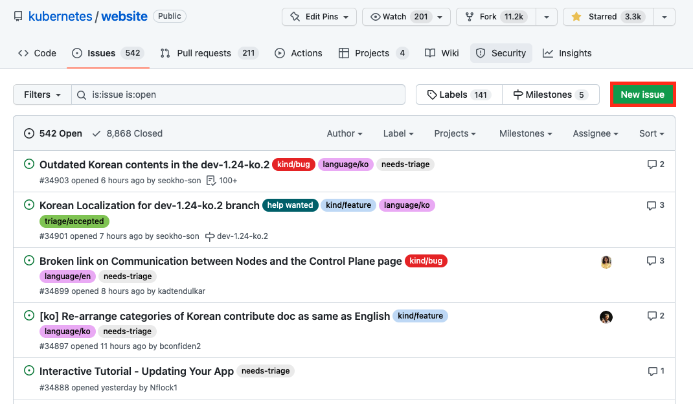
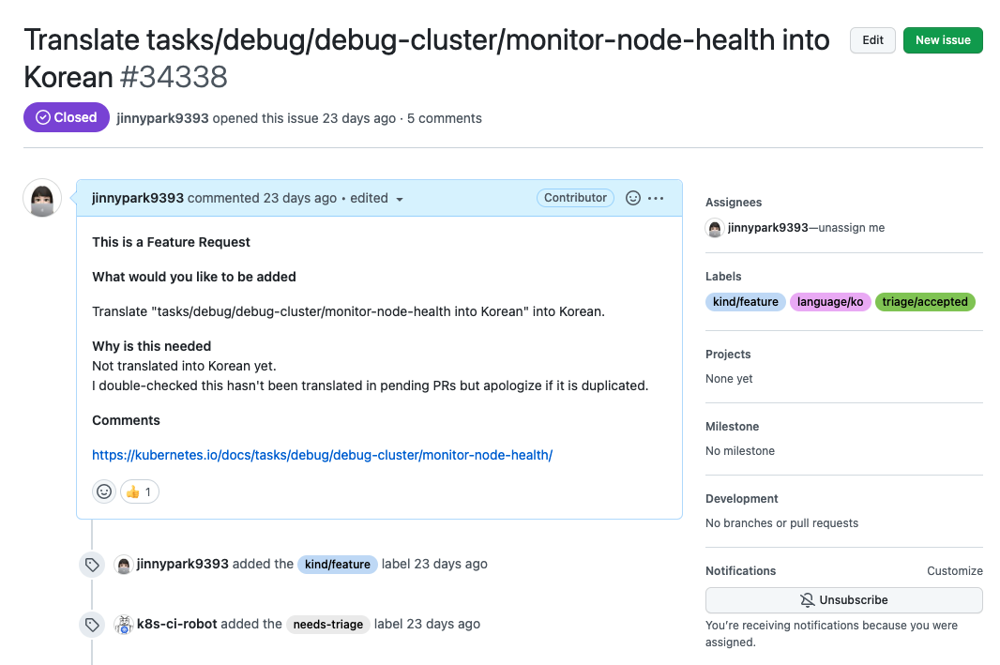
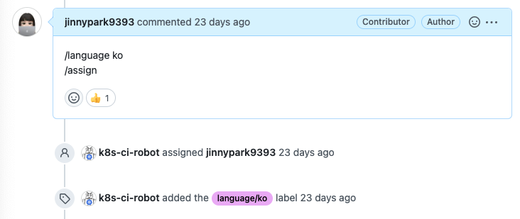
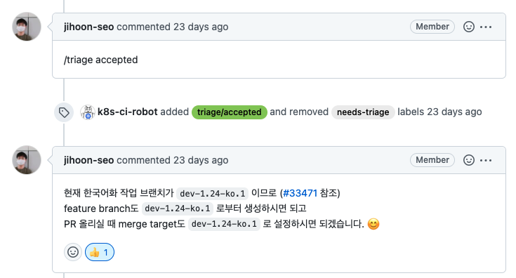

참고: 이 포스팅은 유투브에 올라온 [Kubernetes 오픈소스 컨트리뷰션 방법 소개 (한글화 기여를 통해 쿠버네티스에 참여하기, CNCG2020 발표)](https://www.youtube.com/watch?v=2JiKkPv_IGs) 및 [[Youtube]초간단 쿠버네티스 문서 한글화 시작 가이드](https://www.youtube.com/watch?v=OTl8HBjxIhc) 영상, [Kubernetes Contributor Cheatsheat](https://www.kubernetes.dev/docs/contributor-cheatsheet/), [쿠버네티스 문서 한글화 가이드](https://kubernetes.io/ko/docs/contribute/localization_ko/) 문서를 참조하여 직접PR을 올린 경험을 토대로 작성 된 자료입니다. 혹시 잘못된 부분이 있을 경우에는 메일(jinnypark9393@gmail.com)로 알려주시면 반영하도록 하겠습니다 😊

 

참고로 쿠버네티스 공식 문서에 공헌하는 방법은

- 한글화가 되지 않은 영문 페이지를 한국어로 번역
- 한국어 페이지에서 오타 또는 틀린 내용의 수정
- 영문 페이지에서 오타 또는 틀린 내용의 수정

등 여러 방법이 있지만, 나는 첫 번째 방법인 한글화가 되지 않은 영문 페이지를 한국어로 번역하는 방법에 대해 설명하도록 하겠다.

 

# 쿠버네티스 공식문서 한글화에 기여하는 방법 시리즈

- [쿠버네티스 공식문서 한글화에 기여하는 방법(1)사전준비 & 이슈 생성하기](https://jinnypark9393.github.io/220710-ossca-kubernetes-docs-localization1/)
- [쿠버네티스 공식문서 한글화에 기여하는 방법(2)소스코드 복사 & 번역하기](https://jinnypark9393.github.io/220717-ossca-kubernetes-docs-localization2/)
- [쿠버네티스 공식문서 한글화에 기여하는 방법(3)PR(Pull Request)생성 & CLA 서명](https://jinnypark9393.github.io/220914-ossca-kubernetes-docs-localization3/)
- [쿠버네티스 공식문서 한글화에 기여하는 방법(4)리뷰 내용 반영 & 승인 완료](https://jinnypark9393.github.io/220914-ossca-kubernetes-docs-localization4/)

 

# 1. 쿠버네티스 공식문서 한글화에 기여하는 방법(1)

## 1. 사전 준비

- [Github](https://github.com/) 에 가입한다.
- Local PC에 [Git](http://git-scm.com/downloads)을 설치한다.
- 원하는 IDE를 설치한다(내 경우에는 [VScode](https://code.visualstudio.com/download)를 설치하였다).

  

## 2. kubernetes/website 레파지토리에 이슈 생성하기

쿠버네티스 문서 한글화 작업을 시작하기 전, 일감을 찾아보자.

- [쿠버네티스(한국어) 공식사이트](https://kubernetes.io/ko/docs/)를 접속한다.
    
    
    
 

- 문서의 탭들을 클릭하면서 아직 한글화 되지 않은 문서를 찾는다.
    
    
    
 

- `kubernetes/website` repository에 접속해 이미 다른 사람이 번역하고 있는지 확인한다.
    - Issues 탭에서 `language/ko` 태그를 단 이슈를 sorting해 내가 작업하려는 문서와 동일한 이슈가 있는지 확인한다.
        
        
        
    - Issues 탭에서 동일한 이슈를 찾지 못했다면, 이번에는 `Pull Requests` 탭에 들어가 `language/ko` 태그를 단 PR을 sorting한 뒤, 현재 한글화 팀에서 관리중인 PR에서 내가 작업하려는 문서가 이미 한글화가 되어있는 문서가 아닌지 확인한다.

    
        
    - Files Changed 탭에서 이미 해당 문서의 파일이 포함되어있다면 한글화 작업이 끝난 것이니 다른 일감을 찾아보도록 하자.
    - *참고: 내가 처음 PR을 올렸을 때는 이 부분을 확인하지 않고 냅다 번역부터 시작한 뒤에서야 이슈를 올려서 [헛고생](https://github.com/kubernetes/website/issues/34336)을 했었다😞(바보임). 한글화 작업을 시작하기 전에 1) 중복되지 않는지 꼭 확인하고 2) 이슈를 먼저 올려 내가 작업하고 있다는 사실을 다른 사람들에게 꼭 알리도록 하자*.

 

일감을 찾았다면 `kubernetes/website` repository에 이슈를 올려보자.

- `kubernetes/website` repository → Issues → New Issue를 클릭한다.
    
    

 

- 아래 예시를 참고해 이슈를 작성한다.
    - 제목: [ko]Translate `문서경로(예: tasks/debug/debug-cluster/monitor-node-health` into Korean
      - 참고: 나는 오픈소스 컨트리뷰션 아카데미에 참여하기 전 해당 Issue 및 PR을 완료했던 관계로 [ko]라는 prefix를 붙이지 않았지만, 한글화팀 멘토님께서 협업의 편의성을 위해 [ko]라는 prefix를 제목에 달아주는 것을 권장하셨으니 이 포스팅을 참고해서 작업하시는 분들께도 [ko]를 제목에 붙일 것을 권장한다.
    - 내용: 양식에 맞춰 작성한다(localization 작업이기 때문에 길게 작성할 필요는 없고, ‘한글화가 되지 않았기 때문’이라고 작성해주면 된다).
    
    
    

 

- 이슈를 올린 뒤에는 한글화팀 멤버들이 내 이슈를 찾아 나를 담당자로 지정(assign)할 수 있도록 필요한 태그를 코멘트에 적어준다 (`/language ko` & `/assign`)
    
    
    
 

- 한글화팀에서 내 이슈를 확인하게 되면 `triage accepted` 태그를 달아주시고 친절하게 안내 코멘트도 달아주신다.

- 참고로 한글화 팀에서는 2~3주 주기로 PR을 main 브랜치에 병합하고 있는데, 해당 주기에서 한글화 작업에 사용하는 브랜치는 Github 이슈(예시: [dev-1.24-ko.2 공지](https://github.com/kubernetes/website/issues/34901)) 및 쿠버네티스 슬랙의  `#kubernetes-docs-ko` 채널에서 공지하고 있으니 **작업 전 어느 브랜치에서 작업해야하는지 반드시 확인하도록 하자**.

 

이제 일감이 정해졌으니 다음 포스팅에서는 본격적으로 `kubernetes/website` 의 소스코드를 복사해 작업을 시작해보자.

# 다음 포스팅

- [쿠버네티스 공식문서 한글화에 기여하는 방법(2)소스코드 복사 & 번역하기](https://jinnypark9393.github.io/oss%20contribution%20academy/OSS-Kubernetes-Contribute-to-k8s-Docs-Localization1/)
