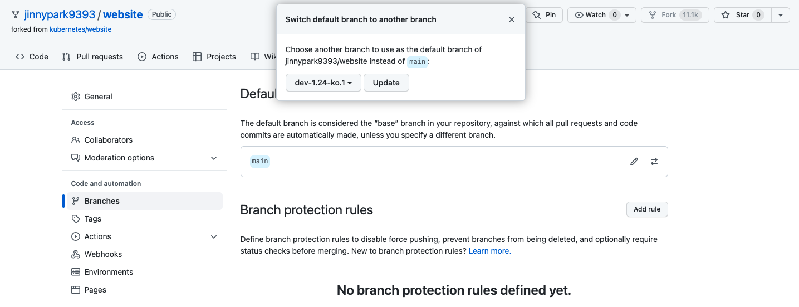
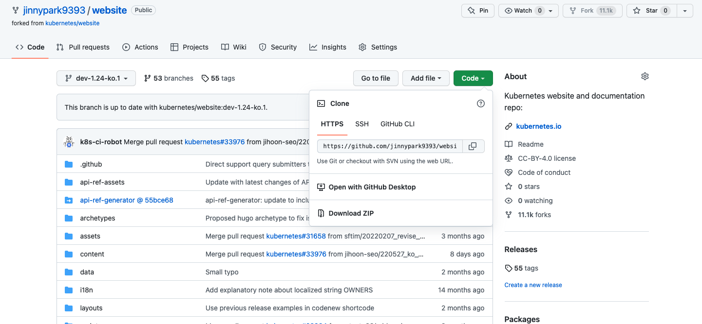

참고: 이 포스팅은 유투브에 올라온 **[Kubernetes 오픈소스 컨트리뷰션 방법 소개 (한글화 기여를 통해 쿠버네티스에 참여하기, CNCG2020 발표)](https://www.youtube.com/watch?v=2JiKkPv_IGs)** 및 **[[Youtube]초간단 쿠버네티스 문서 한글화 시작 가이드](https://www.youtube.com/watch?v=OTl8HBjxIhc)** 영상, [Kubernetes Contributor Cheatsheat](https://www.kubernetes.dev/docs/contributor-cheatsheet/), [쿠버네티스 문서 한글화 가이드](https://kubernetes.io/ko/docs/contribute/localization_ko/) 문서를 참조하여 직접PR을 올린 경험을 토대로 작성 된 자료입니다. 혹시 잘못된 부분이 있을 경우에는 메일(jinnypark9393@gmail.com)로 알려주시면 반영하도록 하겠습니다 😊

<br/><br/>

# 쿠버네티스 공식문서 한글화에 기여하는 방법 시리즈

- [쿠버네티스 공식문서 한글화에 기여하는 방법(1)사전준비 & 이슈 생성하기](https://jinnypark9393.github.io/220710-ossca-kubernetes-docs-localization1/)
- [쿠버네티스 공식문서 한글화에 기여하는 방법(2)소스코드 복사 & 번역하기](https://jinnypark9393.github.io/220717-ossca-kubernetes-docs-localization2/)
- 쿠버네티스 공식문서 한글화에 기여하는 방법(3)PR(Pull Request)생성 & CLA 서명 (작성중)
- 쿠버네티스 공식문서 한글화에 기여하는 방법(4)리뷰 내용 반영 & 승인 완료 (작성중)

<br/><br/>

# 1. 쿠버네티스 공식문서 한글화에 기여하는 방법(2)

## 1. 소스코드 복사 및 로컬 다운로드(fork & clone)

이제 일감이 정해졌으면 [쿠버네티스 공식 웹사이트 repository](https://github.com/kubernetes/website)를 내 repository로 fork해보자. fork는 간단하게 설명하면 다른 사람이 생성한 repository를 내 계정으로 복사하는 기능이라고 생각하면 된다.

<br/>

내 계정으로 `kubernetes/website` 저장소를 fork 한 뒤, 편의를 위해 해당 저장소의 기본 브랜치를 현재 한글화팀에서 작업하고 있는 브랜치로 변경한다.

<br/>



- 참고: 현재 쿠버네티스 한글화팀에서 작업하고 있는 브랜치를 알기 위해서는 Github 이슈나 kubernetes slack의 `#kubernetes-docs-ko` 채널을 참조한다(상세 설명은 [지난 포스팅](https://jinnypark9393.github.io/oss%20contribution%20academy/OSS-Kubernetes-Contribute-to-k8s-Docs-Localization1/)을 참조).

<br/>

그 다음에는, 내 local PC로 git clone하기 위해 fork한 저장소의 주소를 복사한다.



<br/>

`git clone` 명령어를 이용해 fork한 저장소를 복사해온다.

```bash
Documents git:(master) ✗ git clone <복사한 저장소 URL>
```

- 참고: 쿠버네티스 공식 저장소 원본을 복사하지 않도록 주의한다.

<br/>

clone이 완료되면, clone한 website 디렉터리로 이동(`cd` 명령어 이용)해 작업해야할 브랜치를 잘 받아왔는지 확인한다.

```sql
➜  Documents git:(master) ✗ cd website
➜  website git:(dev-1.24-ko.1) ✗ 
```

<br/>

- 당시 작업 브랜치였던 `dev-1.24-ko.1` 로 기본 설정되어있음을 확인할 수 있다.

<br/>

이 다음으로는 내가 작업하는 브랜치를 다른 브랜치와 명확하게 구분하기 위해서 로컬 branch를 하나 새로 생성해준다.

```python
➜  website git:(dev-1.24-ko.1) ✗ git checkout -b jinnypark9393/monitor-node-heal
th/v0.1
Switched to a new branch 'jinnypark9393/monitor-node-health/v0.1'
```

<br/>

- 작업 내역을 명확하게 알 수 있도록 `jinnypark9393/monitor-node-health/v0.1` 이라고 브랜치명을 명명했다.

<br/>

그리고 upstream을 추가해주는데, 브랜치를 한글화팀 작업 브랜치였던 `dev-1.24-ko.1`로 추가해준다(**2022년 7월 17일 현재 작업 브랜치는 dev-1.24-ko.2임에 주의**).

<br/>

- kubernetes/website 프로젝트를 upstream에 추가한다.
    
    ```python
    ➜  website git:(jinnypark9393/monitor-node-health/v0.1) ✗ git remote add upstre
    am https://github.com/kubernetes/website.git
    ```
    
<br/>

- upstream에 kubernetes/website가 잘 추가되었는지 확인한다.
    
    ```python
    ➜  website git:(jinnypark9393/monitor-node-health/v0.1) ✗ git remote -v
    origin	https://github.com/jinnypark9393/website.git (fetch)
    origin	https://github.com/jinnypark9393/website.git (push)
    upstream	https://github.com/kubernetes/website.git (fetch)
    upstream	https://github.com/kubernetes/website.git (push)
    ```
    
<br/>

- upstream을 fetch한 뒤 rebase를 진행해 베이스를 최신화한다.
    
    ```python
    ➜  website git:(jinnypark9393/debug-cluster-crictl/v0.1) ✗ git fetch upstream
    remote: Enumerating objects: 7422, done.
    remote: Counting objects: 100% (3778/3778), done.
    remote: Compressing objects: 100% (218/218), done.
    remote: Total 7422 (delta 3626), reused 3684 (delta 3560), pack-reused 3644
    Receiving objects: 100% (7422/7422), 3.54 MiB | 2.61 MiB/s, done.
    Resolving deltas: 100% (5878/5878), completed with 1401 local objects.
    From https://github.com/kubernetes/website
    ...(생략)...
    ➜  website git:(jinnypark9393/debug-cluster-crictl/v0.1) ✗ git rebase upstream/dev-1.24-ko.1
    Successfully rebased and updated refs/heads/jinnypark9393/monitor-node-health/v0.1.
    ```

<br/><br/>

## 2. 문서 번역

문서를 번역하기 위해 원하는 IDE에서 해당 프로젝트 디렉터리(website)를 열어준다(예시에서는 VScode를 사용하였다).

<br/>

website 디렉터리 하위의 `content` 라는 디렉터리 안에 각 언어별 디렉터리가 구분되어있다. 여기서 우리가 필요한 디렉터리는 영문 공식 사이트 정보가 저장되어있는 `en` 디렉터리와 한국 공식 사이트 정보가 저장되어있는 `ko` 디렉터리이다.

<br/>

만약 `ko` 디렉터리 안에 지난 포스팅에서 issue를 올린 문서 파일이 저장이 존재한다면 해당 파일을 활용하면 되나, 만일 해당 파일이 생성되지 않았다면, en에서 ko로 해당 파일을 복사하여 사용한다.

<br/>

지난 번 예시를 들었던 `tasks/debug/debug-cluster/monitor-node-health` 의 경우, `ko/docs/debug/` 하위의 디렉터리 및 파일이 생성되지 않은 상태였으므로, 디렉터리 및 파일을 `en` (전체경로: `website/en/docs/tasks/debug/debug-cluster/monitor-node-health.md`)에서 `ko` 디렉터리의 해당하는 경로로 복사 & 붙여넣기를 해준다. 

<br/>

파일 붙여넣기 후 열면 아래와 같이 영문 파일을 확인할 수 있다.

```bash
---
title: Monitor Node Health
content_type: task
reviewers:
- Random-Liu
- dchen1107
weight: 20
---

<!-- overview -->

*Node Problem Detector* is a daemon for monitoring and reporting about a node's health.
You can run Node Problem Detector as a `DaemonSet` or as a standalone daemon.
Node Problem Detector collects information about node problems from various daemons
and reports these conditions to the API server as [NodeCondition](/docs/concepts/architecture/nodes/#condition)
and [Event](/docs/reference/generated/kubernetes-api//#event-v1-core).

To learn how to install and use Node Problem Detector, see
[Node Problem Detector project documentation](https://github.com/kubernetes/node-problem-detector).

## {}



<!-- steps -->

## Limitations

* Node Problem Detector only supports file based kernel log.
  Log tools such as `journald` are not supported.
...(생략)...
```

이 영문 파일을 번역해 PR을 올리면 된다.

<br/>

번역 작업을 할 때에는, 쿠버네티스 공식 문서를 한글로 번역 시 주의해야할 부분을 숙지하여 번역문을 작성하면 좋다.

<br/>

예를 들어 쿠버네티스 한글화팀에서는 변경사항 추적 및 유지 관리 편의 등을 위해, 번역 파일의 **각 라인이 가급적 영문 Markdown 파일과 동일하도록 작업할 것**을 권장하고 있다.

<br/>

따라서 `reviewers` 정보를 삭제할 경우에도, 해당 행 자체를 삭제하는 것이 아니라 값만 삭제한 빈 줄로 변경해 행 수를 원문과 맞춰주어야 한다.

<br/>

**[수정 전]**

```bash
---
title: Monitor Node Health
content_type: task
reviewers:
- Random-Liu
- dchen1107
weight: 20
---
```

<br/>

**[수정 후]**

```bash
---
title: Monitor Node Health
content_type: task
reviewers:
  
  
weight: 20
---
```

<br/>

이 외에도 한글화 PR을 올리면서 깨달았던(?) 주의 사항은 다음과 같다.

- 번역 파일의 각 라인은 가급적 영문 Markdown파일과 동일하도록 작업해야한다.
    - `reviewers` 정보를 삭제할 경우에도, 해당 행 자체를 삭제하는 것이 아니라 값만 삭제한 빈 줄로 변경해 행 수를 원문과 맞춰주어야 한다.
- 예시로 보여지는 YAML등의 코드블럭 내의 주석 부분도 번역한다.
- 문서 내에 `{}` 형태로 링크되어있는 코드 파일은 해당 경로를 확인하여 `ko` 디렉터리에 해당 파일이 존재하지 않을 경우, `ko` 디렉터리의 해당 경로로 복사해준다.
- 파일 내에서 동일한 용어를 사용할 경우 같은 형태로 맞춰준다(예: 문서 내에 `설정 파일` 이라는 단어가 처음 등장한 이후 같은 단어를 사용하면 설정파일 등으로 표기하지 말고 문서 내에서 일관되게 `설정 파일` 로 표기한다.)
- 일반적인 단어를 일컫는 뜻의 복수형 단어의 경우(예: problems → 문제들(x), 문제(o)), 가급적 단수로 번역한다.
- 기타 번역 시 주의사항은 [이 링크](https://kubernetes.io/ko/docs/contribute/localization_ko/)를 참조한다.

<br/>

다음으로는 실제 PR을 생성해보는 작업을 진행해보자.
