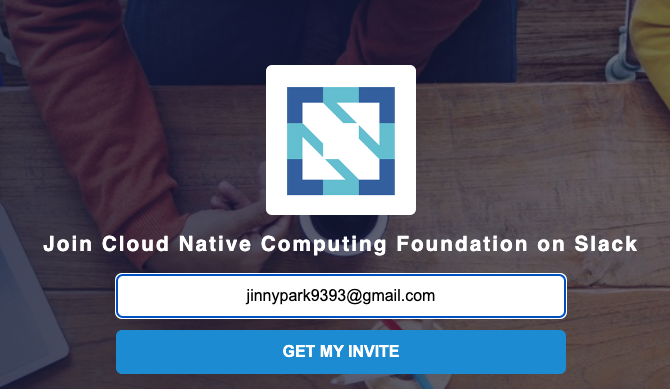
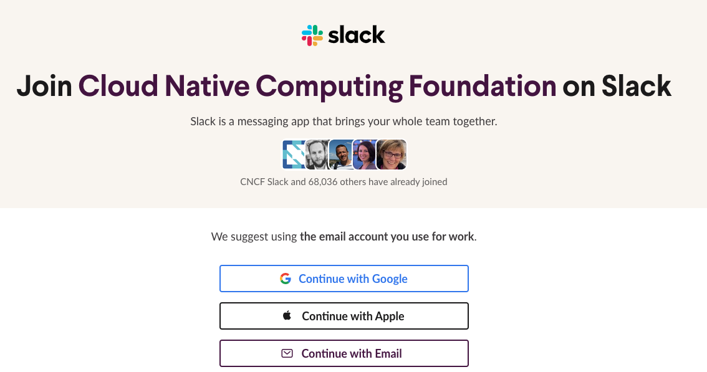
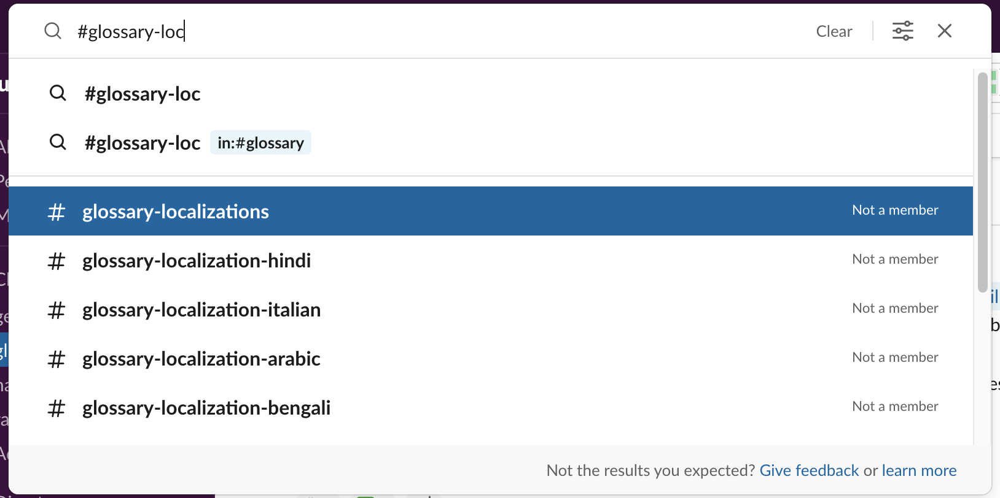
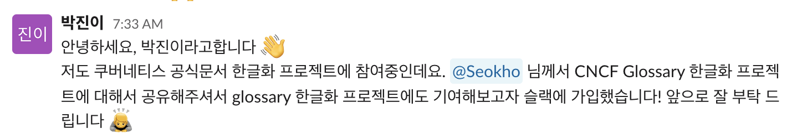

# 1. 배경 상황

2022년도 오픈소스 컨트리뷰션 아카데미에서 쿠버네티스 한글화 프로젝트의 Challengers 프로그램을 수료하고, Masters 프로그램을 시작하게 되었다. Masters 프로그램의 첫 스타트는 쿠버네티스의 관리주체인 CNCF(Cloud Native Computing Foundation)의 또 다른 하위프로젝트, Glossary(용어집) 프로젝트에 기여해보는 것이다.

 

그리고 Glossary 프로젝트 참여의 첫 번째 단계는 바로 슬랙에 참여하는 것.

 

사실 CNCF나 쿠버네티스 프로젝트에 참여하기 위해 슬랙과 같은 소통 채널에 가입하는 것이 필수는 아니지만, 해당 프로젝트를 관리하는 멤버분들이 운영 방식에 대한 논의나 공지를 올릴 때가 있어 프로젝트에 대한 이해도를 높일 수 있다. 또한, PR을 빠르게 머지하기 위해 리뷰를 요청하거나, 멤버십 가입을 위해 voting을 요청할 경우 등 내가 필요한 사항을 요청할 때에도 사용할 수 있는 소통 채널이니 만약 해당 오픈소스 프로젝트 기여에 관심이 있다면 슬랙 & 채널에 가입하고, 인사 메시지를 남겨 미리 눈도장을 찍는 것을 추천한다.

 

# 2. CNCF Glossary(용어집) 프로젝트란?

CNCF Glossary 프로젝트의 공식 명칭은 클라우드 네이티브 용어집(Cloud Native Glossary)으로, 웹사이트에 기재된 설명에 따르면 해당 프로젝트의 목적은 다음과 같다.

 

**클라우드 네이티브 용어집(Cloud Native Glossary)은 CNCF 비지니스 벨류 서브커미티(BVS, Business Value Subcommittee)가 주도하는 프로젝트다. 이 프로젝트의 목적은 사전 기술 지식이 없이도 명확하고 간단한 언어로 클라우드 네이티브 개념을 설명하는 것이다.**

 

이 클라우드 네이티브 용어집 프로젝트는 쿠버네티스 공식문서와 마찬가지로 Hugo 라는 정적 웹사이트 생성기를 사용하고 있어, 쿠버네티스 공식문서 프로젝트에 참여해 본 사람이라면 보다 쉽게 접근하기 쉬운 프로젝트이다.

 

# 3. CNCF 슬랙 가입하고 Glossary 채널 추가하기

먼저 CNCF의 공식 슬랙을 가입하려면 초대 메일을 받아야하는데, [이 링크](https://slack.cncf.io/) 에 접속하여 초대 메일을 발송할 수 있다.

 

위 링크에 접속하면 아래와 같은 창이 뜨는데, 입력 칸에 본인 이메일 주소를 넣고 ‘GET MY INVITE’ 버튼을 클릭하면 해당 이메일로 초대 메일을 받을 수 있다.

 

초대 메일의 링크를 클릭하면, 슬랙 계정에 로그인하라는 창이 뜬다. 나의 경우 지메일을 사용해 슬랙에 가입해두었기 때문에, `Continue with Google` 버튼을 클릭하였다.

 

슬랙 로그인에 성공하면 아래와 같이 내 메일 계정 정보에 문제가 없는지 확인하고, 계정 생성(`Create Account`) 버튼을 누르면 CNCF 슬랙에 가입된다.

![220821-cncf-glossary-slack3.png]./220821-cncf-glossary-slack3.png)

 

CNCF 슬랙 채널 중 glossary와 관계가 있는 채널을 추가해준다. 만약 glossary 한글화 프로젝트에 관심이 있다면, `#glossary` (용어집 프로젝트 전체 채널) `#glossary-localizations` (용어집 현지화 프로젝트 채널) `#glossary-localization-korean` (용어집 한글화 프로젝트 채널)을 검색해 채널을 추가해주면 된다.

 

그리고, 기회가 된다면 간단하게 인사도 남겨보도록 하자 😄

 

다음 포스팅에서는 CNCF glossary 한글화 프로젝트에 기여하는 방법에 대해서 알아보도록 하겠다.

 