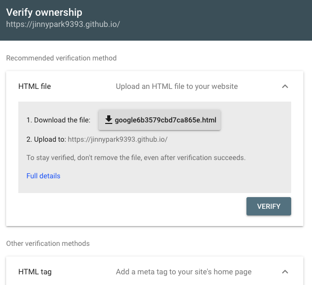
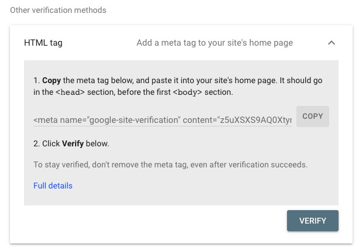
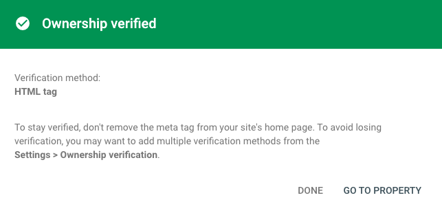

# 1. 배경상황

한두달 전 쯤 깃헙 블로그의 테마를 Jekyll의 Minimal mistakes에서 Gatsby의 Zoomkoding님 테마로 변경 했다. 테마 변경 직후에 Jekyll에서 수집이 되지 않던 사이트맵이 Zoomkoding님 테마로 전환 이후에 잘 수집되는 것을 확인하고는 이후에 서치콘솔에 들어가 확인하지 않았는데, 오랜만에 들어가보니 아예 사이트 소유권 증명이 풀려있었다;; (당연함.. 소유권 증명을 HTML 태그로 했었는데 새로운 코드를 덮어 씌웠으니 소유권 증명이 될 리가..) 그래서 다시 소유권 등록을 진행해주었다.

<br/>

# 2. 구글 서치콘솔 등록 방법

구글 서치콘솔은 구글에 내 사이트를 등록해 구글에서 키워드를 검색했을 때 검색결과에 내 블로그를 노출시켜준다(반대로 말하면, 깃헙 블로그의 경우 네이버 블로그와는 달리 블로그를 생성한 뒤 구글 서치콘솔을 비롯한 각종 서치콘솔에 등록해주지 않으면 직접 블로그 URL을 타고 들어오지 않는 한 어디에서도 내 블로그를 찾을 수 없다ㅎㅎ..).

<br/>

먼저 구글 서치 콘솔 사이트([Google Search Console URL](https://search.google.com/search-console/about?hl=ko))에 접속한 뒤, 시작하기 버튼을 누른다. 그러면 `도메인` 과 `URL 접두어` 2개의 옵션 중 하나를 선택하라는 팝업이 뜨게 된다. 만약 본인이 도메인을 구입한 것이 아니라 깃헙 블로그의 기본 도메인(https://내깃헙아이디.github.io)를 사용하고 있다면 `URL 접두어 옵션` 을 선택해 내 블로그 주소를 입력한 뒤 계속 버튼을 눌러주자.

<br/>

그 뒤에는 HTML 파일을 업로드해 소유권을 증명하라는 옵션이 기본으로 뜨게 되는데, 우리는 그 밑에 보이는 `HTML tag` 옵션을 선택해준다.



<br/>

HTML tag 옵션을 선택하면 아래와 같이 `<meta name~` 으로 시작하는 태그가 있는데, 이것을 미리 복사해두자.



<br/>

로컬에 받아둔 깃헙 블로그 코드 저장소를 VScode 등 IDE로 열어준다. 우리는 react-helmet이라는 react 라이브러리를 이용해 head에 위 태그를 넣어줄 것이다. 참고로 [react-helmet](https://github.com/nfl/react-helmet)은 리액트 컴포넌트들이 문서의 헤드를 바꿀 수 있게 도와주는 라이브러리이다.

<br/>

해당 라이브러리를 다운로드 하지 않았다면 `yarn add react-helmet` 등의 명령어를 통해 받아주면 되는데, Zoomkoding님의 테마로 깃헙블로그 생성을 진행했다면 별도로 받지 않아도 된다. Zoomkoding님 소스코드 기준으로 사용 라이브러리들은 package.json에서 확인할 수 있다. 

<br/>

package.json 파일을 열어보면, 아래와 같이 react-helmet을 비롯해 sitemap, google analytics에 대한 라이브러리도 함께 들어가있는 것을 알 수 있다.

```json
...(생략)...
"gatsby": "^4.9.3",
    "gatsby-plugin-advanced-sitemap": "^2.0.0",
    "gatsby-plugin-google-analytics": "^4.9.0",
    "gatsby-plugin-image": "^2.9.1",
    "gatsby-plugin-manifest": "^4.9.1",
    "gatsby-plugin-offline": "^5.9.1",
    "gatsby-plugin-react-helmet": "^5.9.0",
    "gatsby-plugin-robots-txt": "^1.7.0",
...(생략)...
```

<br/>

그 다음, HTML head 태그를 수정하려면, 아래 경로의 index.js 파일을 열어준다.

```bash
src/components/seo/index.js
```

<br/>

해당 파일을 보면 `<Helmet`으로 시작하는 태그 하위의 `meta` 부분에 각종 property와 값들이 들어가있을 것이다. 우리는 맨 아래로 내려가 아래 항목을 추가해주면 된다.

```jsx
        {
          name: 'google-site-verification',
          content: 'z5uXSXS9AQ0XtymW77I2yTTZtYsZD2jbJ7a1qCo6seM'
        }
```

<br/>

이 때 name에는 구글 서치콘솔에서 복사한 meta 태그의 name에 해당하는 값을, content의 경우에는 content에 해당하는 값을 복사해 넣어준다.

<br/>

그리고 `git add & commit & push`를 이용해 main 브랜치에 해당 변경사항을 반영한 뒤, 웹사이트에도 추가 태그를 반영하기 위해 `npm run deploy` 로 배포해준다. 그리고 난 뒤, 구글 서치콘솔로 돌아가 verification 요청을 눌러주면 아래와 같이 소유권이 확인되었다는 표시가 뜨면 잘 등록이 된 것이다.



<br/>