이 포스팅은 유투브에 올라온 **[Kubernetes 오픈소스 컨트리뷰션 방법 소개 (한글화 기여를 통해 쿠버네티스에 참여하기, CNCG2020 발표)](https://www.youtube.com/watch?v=2JiKkPv_IGs)** 및 **[[Youtube]초간단 쿠버네티스 문서 한글화 시작 가이드](https://www.youtube.com/watch?v=OTl8HBjxIhc)** 영상, [Kubernetes Contributor Cheatsheat](https://www.kubernetes.dev/docs/contributor-cheatsheet/), [쿠버네티스 문서 한글화 가이드](https://kubernetes.io/ko/docs/contribute/localization_ko/) 문서를 참조하여 직접PR을 올린 경험을 토대로 작성 된 자료입니다. 혹시 잘못된 부분이 있을 경우에는 메일(jinnypark9393@gmail.com)로 알려주시면 반영하도록 하겠습니다 😊 

<br/>

# **쿠버네티스 공식문서 한글화에 기여하는 방법 시리즈**

- [쿠버네티스 공식문서 한글화에 기여하는 방법(1)사전준비 & 이슈 생성하기](https://jinnypark9393.github.io/220710-ossca-kubernetes-docs-localization1/)
- [쿠버네티스 공식문서 한글화에 기여하는 방법(2)소스코드 복사 & 번역하기](https://jinnypark9393.github.io/220717-ossca-kubernetes-docs-localization2/)
- [쿠버네티스 공식문서 한글화에 기여하는 방법(3)PR(Pull Request)생성 & CLA 서명](https://jinnypark9393.github.io/220914-ossca-kubernetes-docs-localization3/)
- [쿠버네티스 공식문서 한글화에 기여하는 방법(4)리뷰 내용 반영 & 승인 완료](https://jinnypark9393.github.io/220914-ossca-kubernetes-docs-localization4/)
  
<br/>

# 1. 쿠버네티스 공식문서 한글화에 기여하는 방법(3)

지난 포스팅을 참고하여 문서 번역을 마쳤다면, 이제 번역한 내용을 실제 쿠버네티스 공식문서에 반영하기 위해 PR(Pull Request) 올려보도록 하자.

<br/>

## 0. 로컬 소스코드의 최신화

본격적으로 PR을 올리기 전, git fetch와 git rebase를 통해 소스코드를 다시 최신화해준다.

<br/>

먼저 upstream의 브랜치들을 최신화한다.

```bash
$ git fetch upstream
```

<br/>

다음으로는 공식문서 한글화팀에서 현재 사용하고 있는 브랜치로 체크아웃한 뒤 최신화한다.

```bash
$ git rebase upstream/dev-1.24-ko.1
```

<br/>

- 참고로, 한글화팀 작업 브랜치의 naming convention은 다음과 같다.
    - 예: `dev-1.24-ko.1`
    - `1.24` → 쿠버네티스 버전
    - `1` → 마일스톤 버전(3주 주기로 갱신됨).

그리고 현재 작업중인 브랜치가 앞 포스팅에서 생성한 [개인 작업브랜치](https://jinnypark9393.github.io/220717-ossca-kubernetes-docs-localization2/)가 맞는지 확인한 뒤 PR을 생성하도록 하자.

```bash
➜  website git:(jinnypark9393/debug-cluster-crictl/v0.1) ✗ git branch
* 220914-ko-adopt-new-localization-string-for-release
  dev-1.24-ko.1
  dev-1.24-ko.2
  dev-1.24-ko.3
  main
```

<br/>

## 1. PR(Pull Request)올리기

번역 작업을 마친 마크다운파일을 원격 저장소에 업데이트하기 전, 빌드에 문제가 없는지 로컬에서 먼저 확인 한다(로컬빌드 방법 참고 링크는 [여기](https://jinnypark9393.github.io/220709-ossca-kubernetes-hugo-local-build/)).

<br/>

번역 작업 및 로컬 빌드 검증이 완료되었다면 git add & commit으로 커밋을 생성한다.

```bash
➜  website git:(jinnypark9393/monitor-node-health/v0.1) ✗ git add .
➜  website git:(jinnypark9393/monitor-node-health/v0.1) ✗ git commit -m "Translate tasks/debug/debug-cluster/monitor-node-health into Korean"
[jinnypark9393/monitor-node-health/v0.1 4bb2624993] Translate tasks/debug/debug-cluster/monitor-node-health into Korean
 1 file changed, 153 insertions(+)
 create mode 100644 content/ko/docs/tasks/debug/debug-cluster/monitor-node-health.md
➜  website git:(jinnypark9393/monitor-node-health/v0.1) git push
fatal: The current branch jinnypark9393/monitor-node-health/v0.1 has no upstream branch.
To push the current branch and set the remote as upstream, use

    git push --set-upstream origin jinnypark9393/monitor-node-health/v0.1
```

<br/>

원격 저장소 중 origin(공식 문서 저장소를 fork하여 저장한 내 원격저장소)에 커밋 내역을 push한다.

```sql
➜  website git:(jinnypark9393/monitor-node-health/v0.1) git push --set-upstream origin jinnypark9393/monitor-node-health/v0.1
Enumerating objects: 14, done.
Counting objects: 100% (14/14), done.
Delta compression using up to 4 threads
Compressing objects: 100% (8/8), done.
Writing objects: 100% (9/9), 3.44 KiB | 3.44 MiB/s, done.
Total 9 (delta 5), reused 0 (delta 0), pack-reused 0
remote: Resolving deltas: 100% (5/5), completed with 5 local objects.
remote:
remote: Create a pull request for 'jinnypark9393/monitor-node-health/v0.1' on GitHub by visiting:
remote:      https://github.com/jinnypark9393/website/pull/new/jinnypark9393/monitor-node-health/v0.1
remote:
To https://github.com/jinnypark9393/website.git
 * [new branch]            jinnypark9393/monitor-node-health/v0.1 -> jinnypark9393/monitor-node-health/v0.1
Branch 'jinnypark9393/monitor-node-health/v0.1' set up to track remote branch 'jinnypark9393/monitor-node-health/v0.1' from 'origin'.
```

<br/>

Origin 저장소(내 개인 깃헙 저장소에 fork한 소스코드)로 이동해 작업 브랜치가 잘 생성되었는지 확인하고,

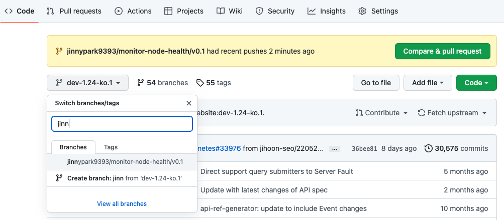

<br/>

`Compare & Pull Request` 버튼을 누른다.

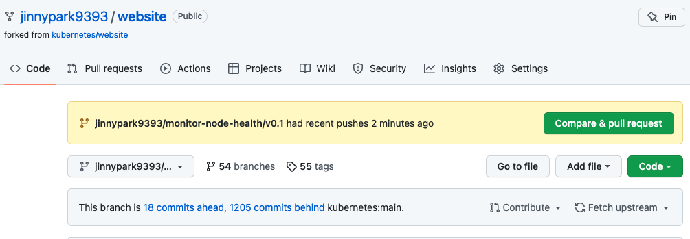

<br/>

필요한 내용을 입력한 뒤 `Create pull request` 버튼을 클릭한다.

- base repository: 쿠버네티스 공식문서의 원본 저장소. `kubernetes/website` (=upstream)
- base: 병합할 대상이 되는 base repository의 브랜치를 지정. `dev-1.24-ko.1`
- head repository: 원본 저장소를 fork한 내 저장소. `jinnypark9393/website` (=origin)
- compare: head repository의 브랜치를 지정. `jinnypark9393/monitor-node-health/v0.1`
- 제목: 제목을 작성할 경우에는 `[ko]` 라는 접두어를 붙여 작성하며, 작업한 문서 경로를 적어주면 좋다.
- 내용: [이전 포스팅](https://jinnypark9393.github.io/220710-ossca-kubernetes-docs-localization1/)에서 생성한 이슈를 연결한다.

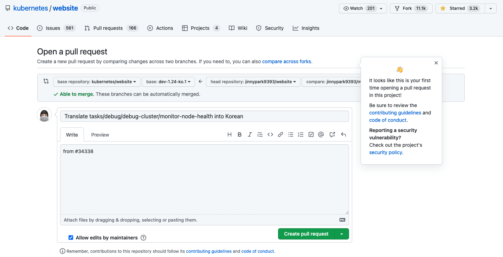

<br/>

CLA에 서명을 하지 않은 채 PR을 생성하게 되면, CLA에 서명해야한다는 코멘트가 달리게 된다. `click here to be authorized` 링크를 클릭해 CLA 서명을 진행하자.

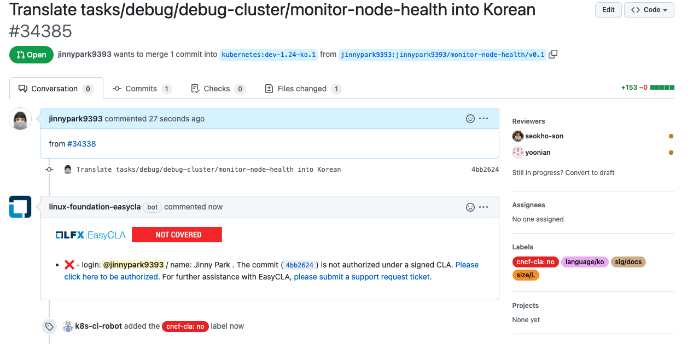

<br/>

깃헙 계정정보 공유를 허락한다는 메시지가 뜨는데, `Authorize LF-Engineering` 버튼을 클릭해 동의한다.

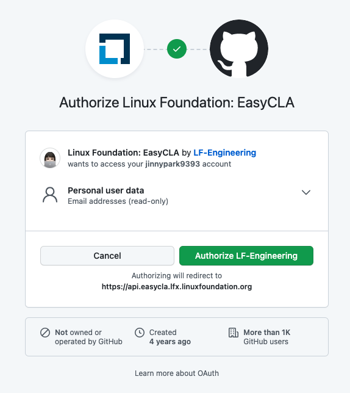

<br/>

우리는 개인 기여자이므로(회사차원에서 기여를 하는 것이 아닐 경우라면 회사 재직 여부와 상관 없이 Individual Contributor임) `Individual Contributor` 를 선택한다.

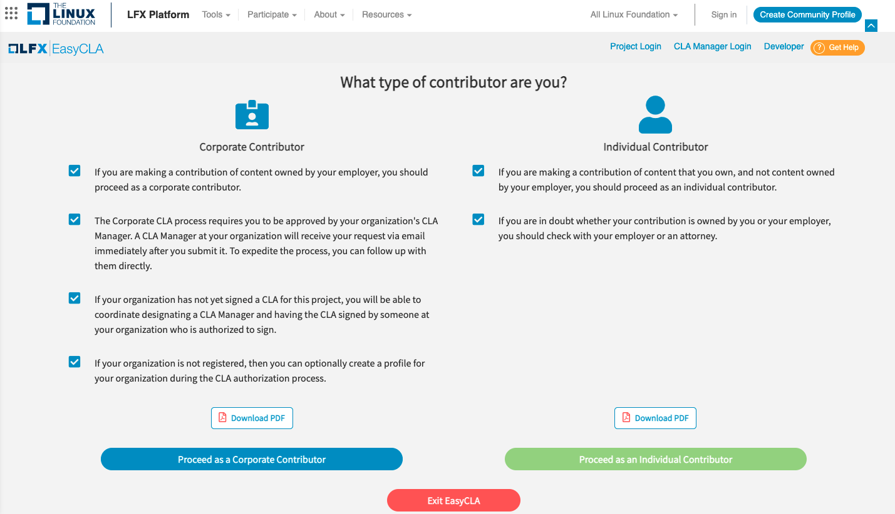

<br/>

`SIGN CLA` 를 클릭한다.

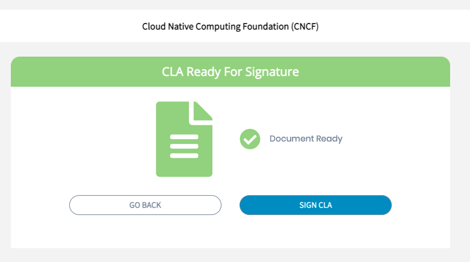

<br/>

Docusign 창으로 넘어가게 되는데, 조항을 읽어본 뒤,

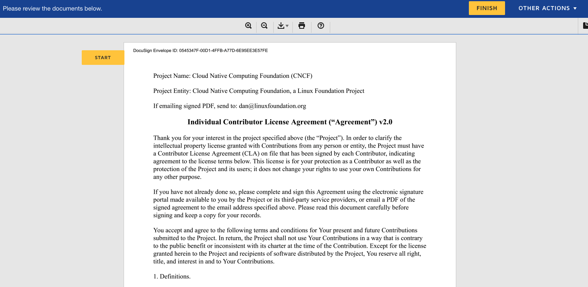

<br/>

이름과 주소, 메일 주소 등 필요한 정보들을 입력한다.

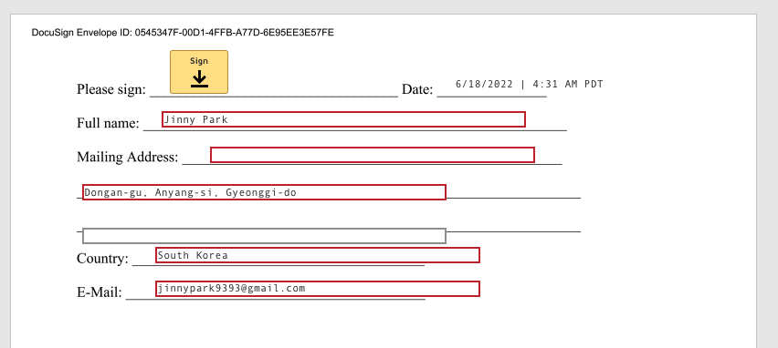

서명의 경우 Please sign 옆의 `Sign` 버튼을 클릭한다.

<br/>

서명을 입력해주면 되는데, 아래와 같이 직접 그리거나 그림 파일을 업로드할 수 있다.

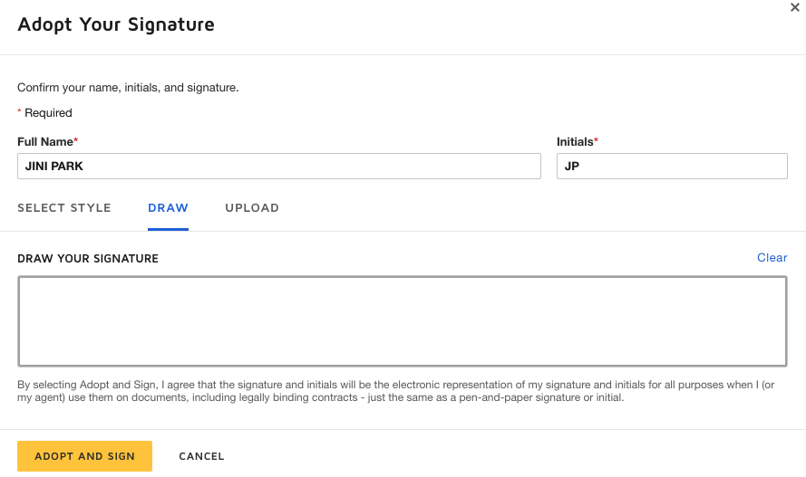

<br/>

서명이 완료된 후 생성한 PR로 돌아가보면 CLA 서명이 완료됨을 확인할 수 있다.

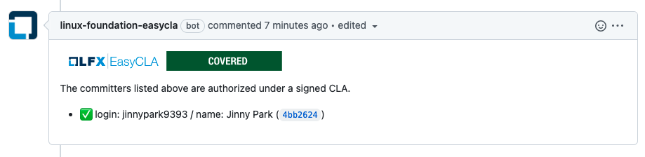

<br/>