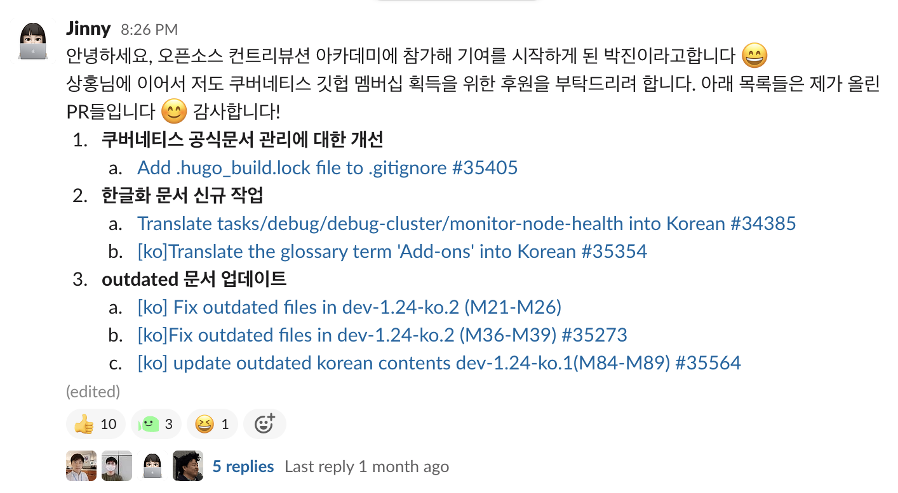
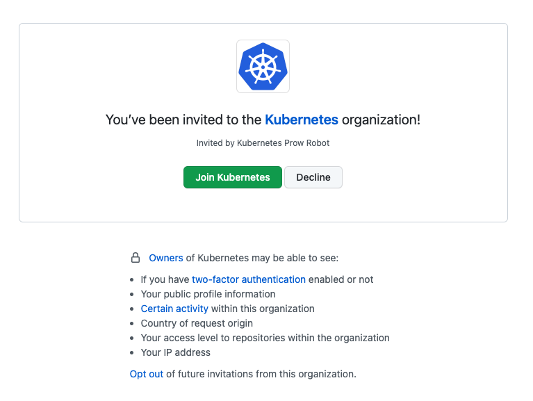
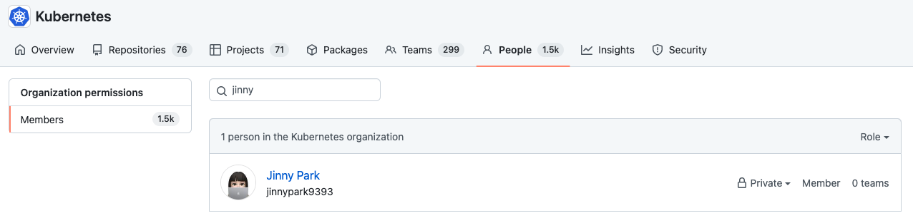

쿠버네티스 공식문서 한글화 작업 등 쿠버네티스 조직의 하위 프로젝트에 대해 기여를 하다보면 쿠버네티스 조직의 정식 멤버십을 신청할 수 있다. 2022년 9월 현재 기준으로는 아래 기준을 충족할 경우 멤버로 등록 요청을 할 수 있다.

 

- 5개의 실질적인 풀 리퀘스트
- 깃헙 계정에 2-Factor authentication 활성화
- [dev@kubernetes.io](https://groups.google.com/a/kubernetes.io/group/dev) 메일리스트 구독
- [기여자 가이드](https://github.com/kubernetes/community/blob/master/contributors/guide/README.md) 정독
- 2명 이상의 리뷰어의 스폰서십

 

# 1. 쿠버네티스 공식 저장소 멤버 신청

## 1. 멤버 신청 조건 충족하기

먼저 위에서 언급한 신청 조건들에 대해 보다 자세히 설명하겠다.

 

### 1. 5개의 실직적인 풀 리퀘스트

쿠버네티스 공식문서 저장소의 가이드라인에서는 5개의 실질적인 풀 리퀘스트를 최소한의 기준으로 삼고 있다.

 

여기서 말하는 `실질적인` 이라는 것은 단순한 오타 수정과 같이 아주 사소한 수정을 제외함을 뜻한다. 실질적인 풀 리퀘스트에 해당하는 예로는 아래와 같은 것들이 있다.

 

- 한글화 되지 않은 마크다운 문서 하나를 통째로 번역
- outdated된 문서들에 대한 업데이트(변경사항이 2~3줄로 미미한 경우 여러개의 문서를 묶어서 번역)
- 쿠버네티스 공식문서에 대한 관리를 개선할 수 있는 방안 제시

 

쿠버네티스 커뮤니티 가이드라인에서는 [최소 1개 이상의 머지된 풀리퀘스트가 있어야 함](https://github.com/kubernetes/community/blob/master/community-membership.md#member)을 추가 조건으로 세우고 있는데, 나는 5개의 모든 PR이 머지된 이후에 멤버 신청을 등록했었다(5개의 PR 중 하나만 머지되어도 등록이 가능한지는 쿠버네티스 슬랙 채널 중 #kubernetes-docs-ko 채널에 문의를 남겨보는 것을 추천한다).

 

### 2. 깃헙 계정에 2-Factor authentication 활성화

쿠버네티스 정식 멤버가 될 경우 쿠버네티스 조직 하위의 저장소에 직접적인 영향을 끼칠 수 있으므로, 쿠버네티스 조직에서는 2FA 활성화를 통해 멤버들의 깃헙 계정의 보안을 강화하도록 하고 있다.

 

깃헙에 로그인 한 뒤 [settings > security](https://github.com/settings/security)에 접속하면, Two-Factor authentication을 활성화 할 수 있는데, 나는 추가 인증장치로 `Authy` 라는 모바일 앱을 사용하고 있다(특정 웹사이트에 국한된 인증 앱이 아니라 다른 웹사이트의 추가 인증장치로 활용할 수 있어서 편리하다. 나는 AWS의 MFA 등록에도 해당 앱을 활용하고 있어서 추가로 Github도 등록해주었다).

 

### 3. dev@kubernetes.io 메일리스트 구독

[이 링크](https://groups.google.com/a/kubernetes.io/g/dev?pli=1)로 접속하면 쿠버네티스 메일 그룹에 가입하여 쿠버네티스 관련 각종 소식(예: 새로운 쿠버네티스 버전 릴리스, 쿠버네티스 조직 활동 등)을 받아 볼 수 있다. 수신 받을 내용/주기 등은 본인이 원하는 대로 설정하면 된다.

 

위 링크가 작동하지 않는 경우에는 `kubernetes/org` 에 신규 이슈 등록 양식에서도 해당 링크를 찾아 볼 수 있다.

 

### 4. 커뮤니티 멤버십 가이드라인 정독

[커뮤니티 멤버십 가이드라인](https://github.com/kubernetes/community/blob/master/community-membership.md)에는 멤버의 종류와 해당 등급이 되기 위한 조건, 역할과 책임들이 나열되어있다. 수시로 업데이트 될 수 있으니 멤버십 신청 전 요구사항을 제대로 충족하였는지 미리 확인하면 좋다.

 

### 5. 2명 이상의 리뷰어의 스폰서십

이제 스폰서를 구하면 멤버 신청에 대한 준비는 거의 마무리 되었다고 보면 되는데, 스폰서십을 구하기 위해서는 쿠버네티스 슬랙 채널 중 자신이 주로 활동했던 채널들에서 모으면 된다.

 

나는 쿠버네티스 공식문서 한글화 작업을 가장 많이 했어서 #kubernetes-docs-ko 채널에서 아래와 같은 메시지를 남겨 스폰서를 모집했다.

 

참고로 스폰서는 2명을 구해야하는데 2명의 스폰서가 각자 다른 조직/회사에 속해있어야 한다(내 경우 처음에 스폰서를 해주시겠다고 손을 들어주신 분들이 오픈소스 컨트리뷰션 아카데미의 멘토님들이셨는데 공교롭게도 두 분다 ETRI에 재직중이셔서 다른 스폰서분을 새로 구해서 멤버십 신청을 진행했다).

 

## 2. 멤버 신청하기

멤버십 신청을 위해서는 `kubernetes/org` 리포지토리에 새로운 이슈를 생성하면 된다. 

 

[이 링크](https://github.com/kubernetes/org/issues/new?assignees=&labels=area%2Fgithub-membership&template=membership.yml&title=REQUEST%3A+New+membership+for+%3Cyour-GH-handle%3E)를 클릭해 신규 이슈 생성 양식을 바로 열 수 있으며, 양식대로 잘 기재해서 등록하면 된다.

 

멤버십 신청은 빨리 되면 며칠 내에 되기도 하지만 보통 1~2주 정도는 소요되는 듯 하다. 멤버십 신청이 승인되고, kubernetes/org 에 권한을 갖고 계신 분이 등록 작업을 완료해주시면, 아래와 같이 깃헙 계정과 연결된 이메일로 쿠버네티스 조직 가입 초대장을 받게 된다. `Join Kubernetes` 링크를 클릭해 등록 작업을 마무리하게 되면 멤버 등록이 완료된다.

 

이제 쿠버네티스 조직에 들어가 깃헙 아이디를 검색하면 내 이름을 찾아볼 수 있다 😃 (뿌듯 그자체)

 

# 3. 참고 자료

- 쿠버네티스 공식문서 - 역할과 책임: [https://kubernetes.io/ko/docs/contribute/participate/roles-and-responsibilities/](https://kubernetes.io/ko/docs/contribute/participate/roles-and-responsibilities/)
- 쿠버네티스 커뮤니티 - 커뮤니티 멤버십: [https://github.com/kubernetes/community/blob/master/community-membership.md#member](https://github.com/kubernetes/community/blob/master/community-membership.md#member)
  
 