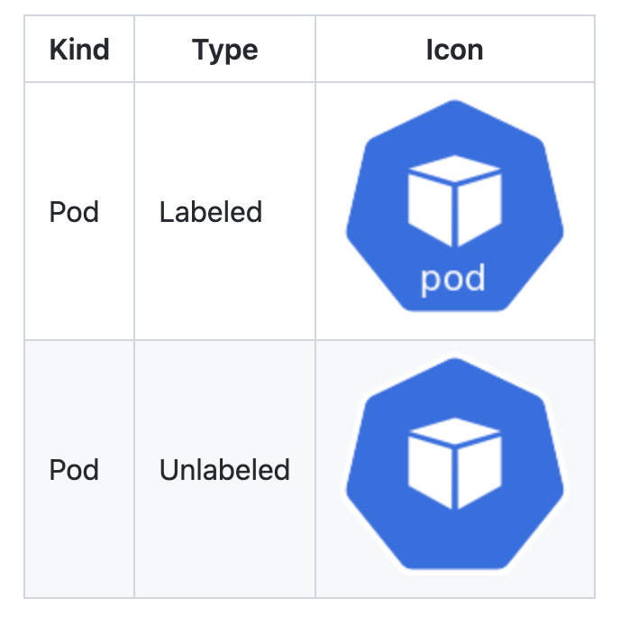

# 1. 배경 상황

이전 회사에서 내부 세미나를 위해 쿠버네티스 컴포넌트를 가지고 아키텍처를 그려야할 일이 생겨서 쿠버네티스 리소스 아이콘이 있는지에 대해 찾아보았다.

# 2. 리소스 아이콘 링크

쿠버네티스는 오픈소스 프로젝트인 만큼 리소스 아이콘에 대해서도 무료로 개방하고 있는데, 쿠버네티스 깃헙 조직 하위의 community 저장소에 들어가면 확인할 수 있다. 아래 링크를 참조하자.

- 링크: [https://github.com/kubernetes/community/tree/master/icons](https://github.com/kubernetes/community/tree/master/icons)

참고로 쿠버네티스 아이콘은 PNG, SVG 두가지 형태로 제공되며, 리소스 이름이 영문으로 적힌 아이콘과 그림만 표시된 아이콘 두 가지 버전을 제공하고있다(하지만 개인적으로는 리소스 도형만 보고는 어떤 리소스인지 유추하기 어려워서 이름 레이블이 달린 아이콘을 사용했었다).

자세한 사용법은 위 링크의 README 파일을 참고하면 된다(Visio용 아이콘 파일도 제공하니 참고하자).

 