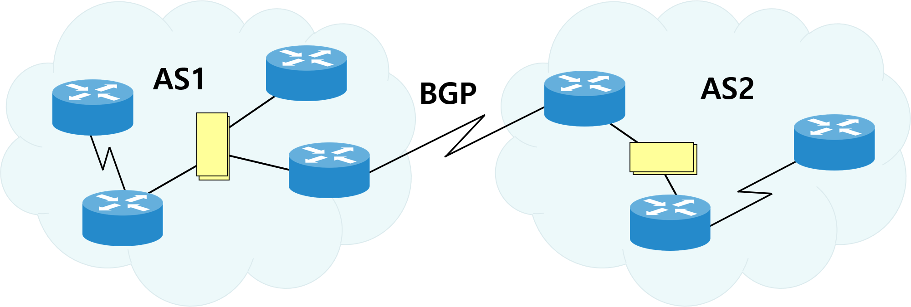
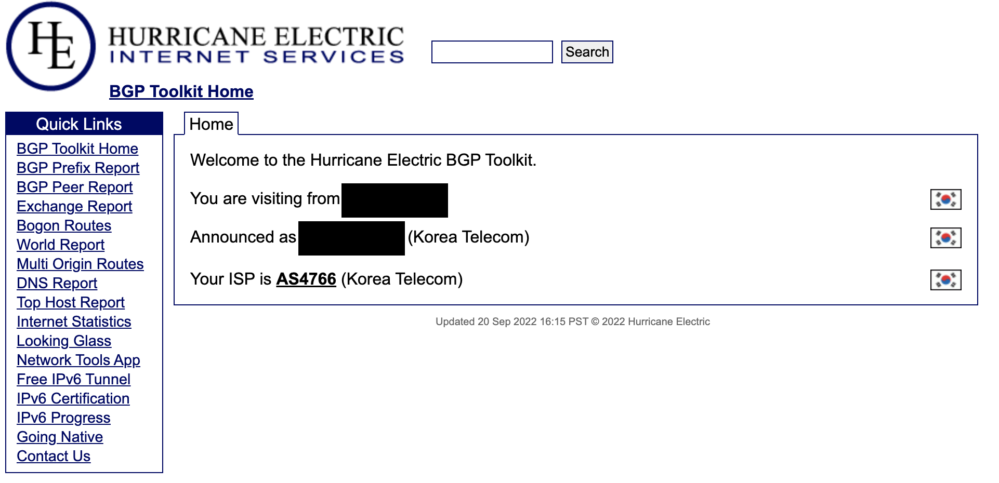
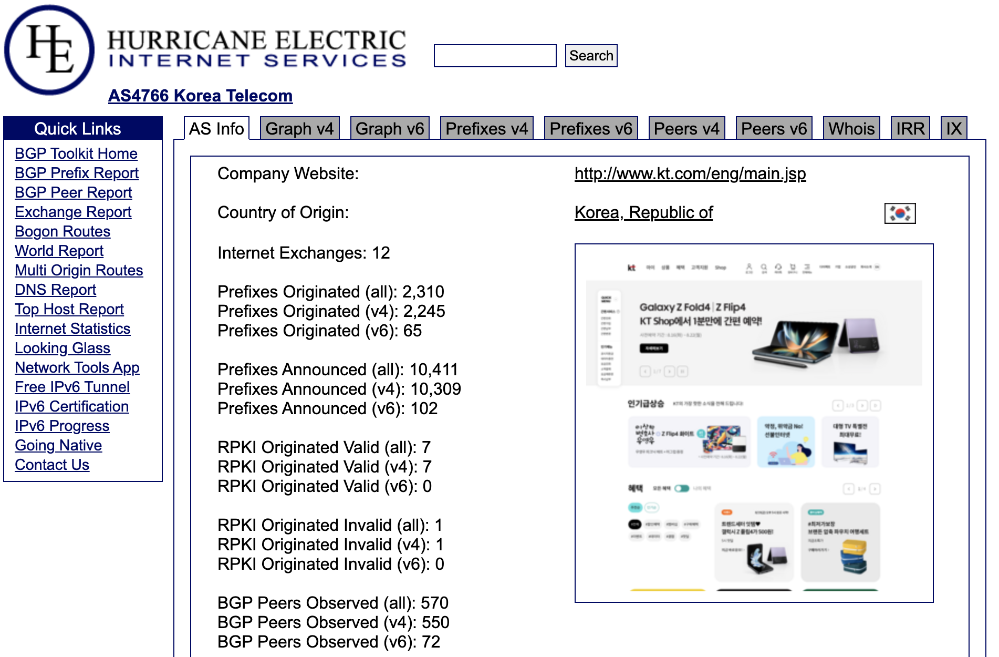
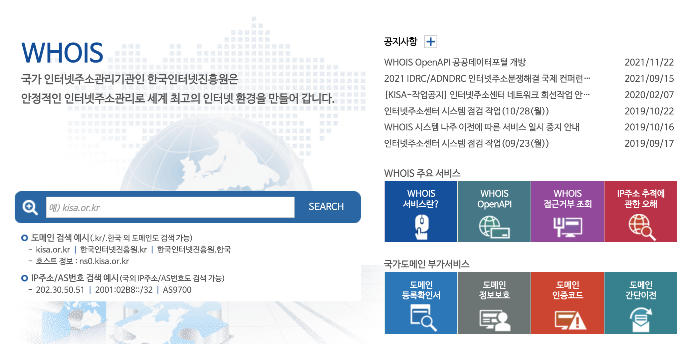
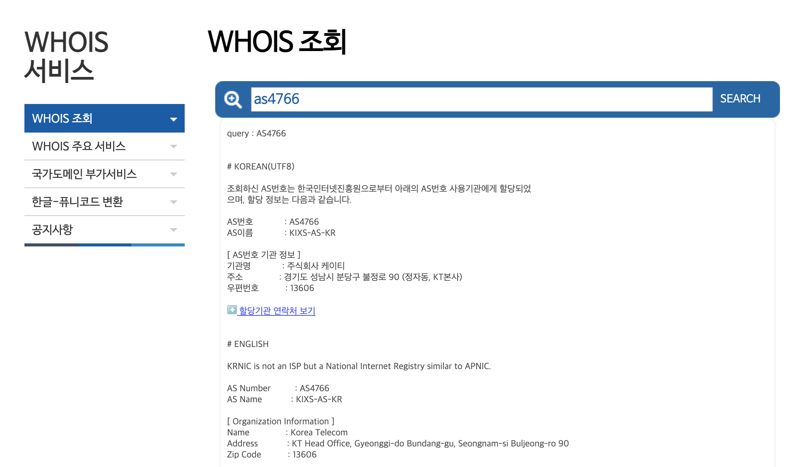

# 1. 배경 상황

이전 프로젝트에서 AWS DX(Direct Connect) 구축 중 연결 정보를 받은대로 넣었음에도 불구하고 Link가 계속 Up 되지 않는 이슈가 있었는데, 알고보니 AS 번호가 잘못 전달이 되어 발생한 이슈였다. 관련해서 검색해보니 내가 이전 직장에서 근무했을 당시 사용했던 사이트 외의 다른 사이트도 찾을 수 있어서 AS번호에 대한 개념을 정리 할 겸 포스팅 하려 한다.

 

# 2. AS number(망 식별 번호)란?

AS Number(Autonomous System Number, ASN)는 한국어로는 망식별번호라고도 한다.

 

동일한 라우팅 정책으로 하나의 관리자에 의해 운영되는 네트워크를 자율 시스템(AS, Autonomous System)이라고 부르며, 각 자율 시스템을 식별하기 위해 만든 고유한 숫자를 망 식별 번호라고 한다.

 

간단하게 설명하면, **여러 IP 대역들을 묶어서 편리하게 통신할 수 있도록 만든 것**이라고 생각하면 되며, 작은 기업에서는 조직 자체에 할당되는 AS번호를 갖지 않고(정확히 말하면 ISP 등 제공자의 AS번호 안에 속해있게 된다) 네트워크 대역을 많이 사용하는 곳에서만 AS번호를 가지고 있다고 보면 된다. 또한, 네트워크망이 거대한 KT, LGUplus, SKB와 같은 ISP(Internet Service Provider: 인터넷 서비스 제공자)의 경우 여러 개의 AS번호를 소유하고 있는 경우가 많다(하나의 AS번호로 운영하는 ISP도 존재).

 

이 AS번호는 IP주소와 마찬가지로 IANA(Internet Assigned Numbers Authority)라는 기관에서 할당하며, AS번호는 16비트의 길이로 1 ~ 65,536 사이의 값을 가진다(64,510 ~ 65,530 영역은 사설용(Private Use)이다.)

 

AS번호는 인터넷의 확산으로 라우팅 정보가 방대해짐에 따라 네트워크 관리범위를 계층적으로 체계화 하기 위해 만들어진 것이다. AS의 도입으로 라우터는 인터넷의 모든 네트워크 도달 정보를 가질 필요 없이 자기가 속한 AS내의 라우터에 대한 도달 가능 정보만을 가지며, 외부 AS와 통신할 때에는 ASBR(Autonomous System Boundary Router)를 이용해 정보를 얻게 된다. 따라서 라우팅 프로토콜은 AS 내부 통신용(IGP, Interior Gateway Protocol)과 AS 외부 통신용(EGP, Exterior Gateway Protocol)으로 나뉘게 되며, IGP의 예로는 RIP, IGRP, EIGRP, OSPF가 있고, EGP에는 BGP가 있다.

 

# 3. AS번호 소유자 확인

AS번호의 소유자를 확인하려면 아래 두 사이트를 활용할 수 있다.

 

## 1. Hurricane Electric Internet Services

- URL: [https://bgp.he.net/cc](https://bgp.he.net/cc)

 

첫 번째 방법은 Hurricane Electric이라는 미국의 Tier 1 인터넷 사업자가 운영하는 BGP Toolkit 사이트를 활용하는 것이다. 

 

아래 화면에서 Search 옆의 입력 란에 검색하고자 하는 AS번호, 혹은 조직명을 입력하면 상세 정보를 확인할 수 있다.

 

예시로 KT의 AS번호인 4766을 검색해보자.

4744로 검색한 결과 해당 AS번호의 간단한 소유자 정보를 확인할 수 있으며,

 

Graph탭, Peers 탭을 이용해 해당 AS번호가 어떤 AS번호와 연결이 되어있는지도 확인할 수 있다(AS번호에 커서를 올리게 되면 해당 AS번호의 소유자를 알 수 있다).

## 2. KISA 후이즈 검색

- URL: [https://후이즈검색.한국](https://xn--c79as89aj0e29b77z.xn--3e0b707e/)

 

다음은 KISA에서 운영하는 후이즈 검색을 이용할 수도 있다. 후이즈 검색에서는 조직명으로 검색은 불가능하며, IP주소 혹은 AS번호로 정보를 검색할 수 있다.

 

후이즈에서도 동일하게 4766번에 대한 정보를 조회해보면, 아래와 같이 조회 결과가 나오게 되는데 HE BGP toolkit과는 다르게 간단한 조직정보만 나오게 된다.

 