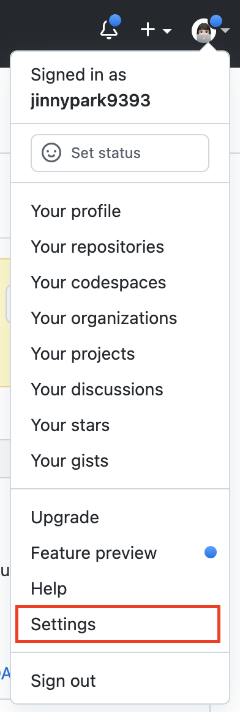
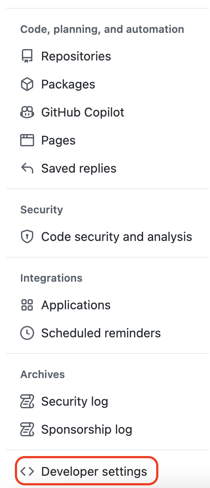
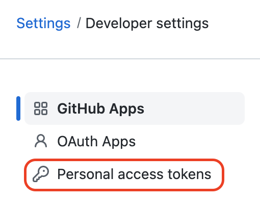
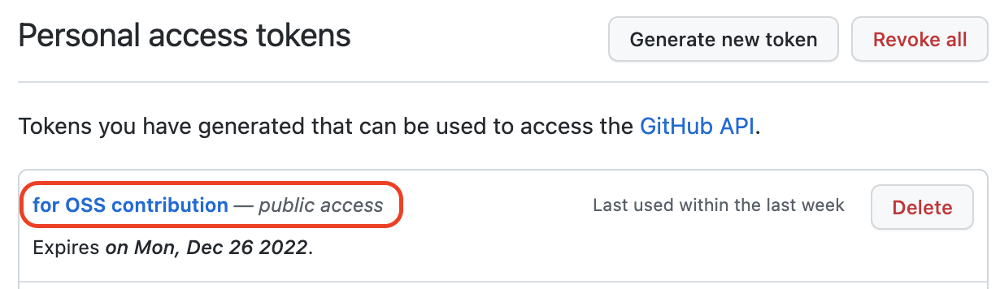
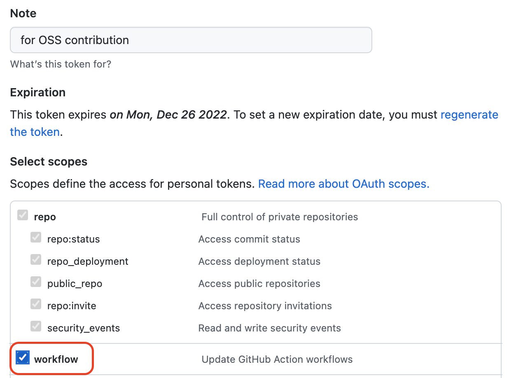
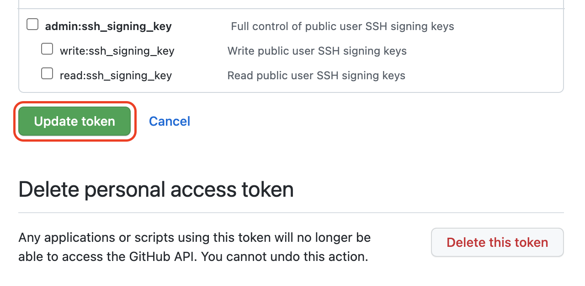

# 1. 배경 상황

CNCF 용어집 한글화 작업 중 기존에 올려 두었던 PR을 수정해야하는 일이 생겼는데, 수정 후 origin(원본 github repository를 fork해서 받아놓은 내 repository)에 변경사항을 push하려고 하니 아래와 같은 에러메시지가 발생했다.

```bash
! [remote rejected] 220821-ko-kubernetes -> 220821-ko-kubernetes (refusing to allow a Personal Access Token to create or update workflow `.github/workflows/es-spellcheck.yml` without `workflow` scope)
error: failed to push some refs to 'https://github.com/jinnypark9393/glossary.git'
```

<br/>

에러 메시지를 읽어보면 로컬의 `220821-ko-kubernetes` 브랜치에서 origin의 `220821-ko-kubernetes` 브랜치로 push하던 중 에러가 발생했다고 한다. 에러 원인은 PAT(Personal Access Token)에 workflow scope이 포함되어있지 않아서, `.github/workflows/es-spellcheck.yml` 라는 워크플로를 생성 혹은 업데이트가 거부되었다라는 메시지였다.

<br/>

# 2. 해결 방법

먼저 본인 깃허브 계정에 접속해 페이지 가장 우측 상단의 프로필 아이콘을 클릭한 뒤 `Settings` 탭으로 접속한다.



<br/>

좌측 메뉴리스트 가장 하단의 `<> Developer settings` 라는 버튼을 클릭한다.



<br/>

그 다음 화면의 좌측 메뉴 리스트의 `Personal access tokens` 탭을 클릭한다.



<br/>

참고로 PAT의 scope은 토큰 생성 후에도 변경이 가능하기 때문에, scope을 추가하기 위해 새로운 토큰을 생성하지 않아도 된다. 기존 생성한 PAT의 scope을 변경하기 위해 생성해둔 토큰명을 클릭한다.



<br/>

Select scopes 에서 workflow의 체크박스를 선택한다.



<br/>

페이지 가장 하단의 `Update token` 버튼을 클릭해 저장한다.



<br/>