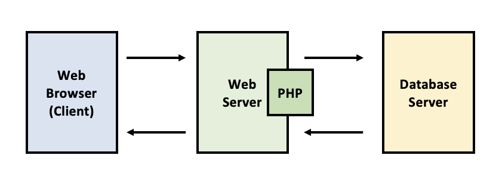
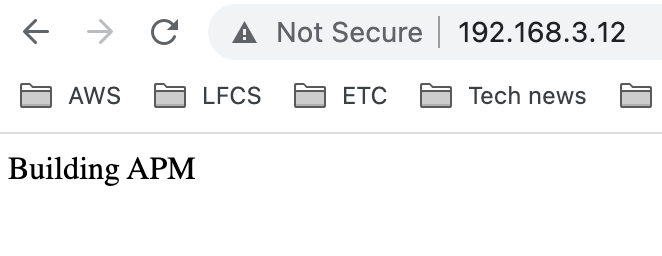
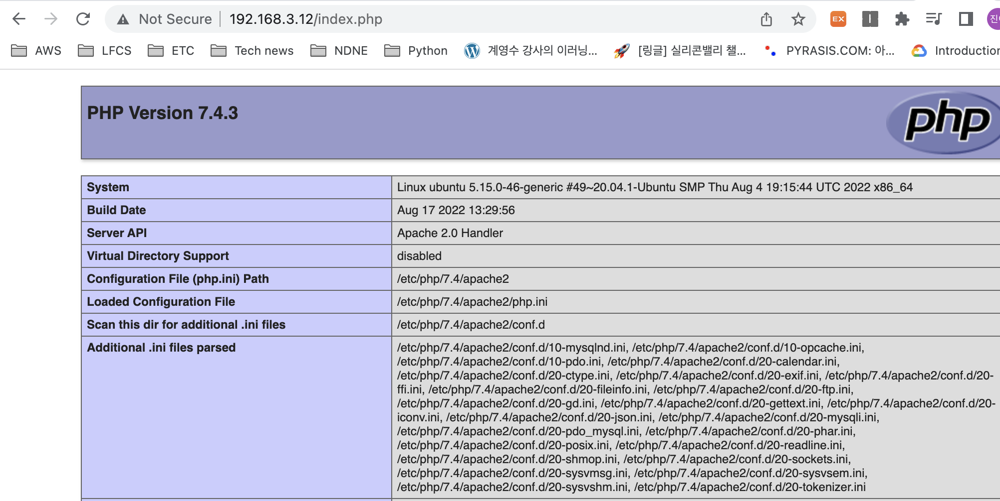
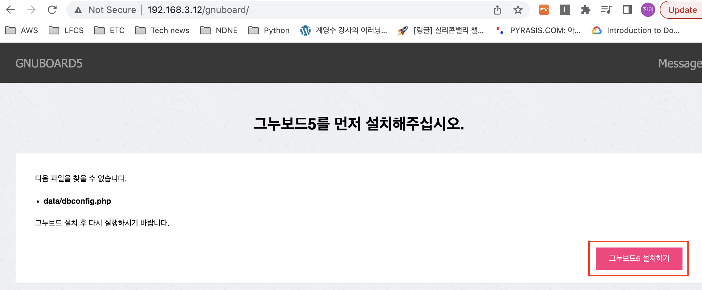
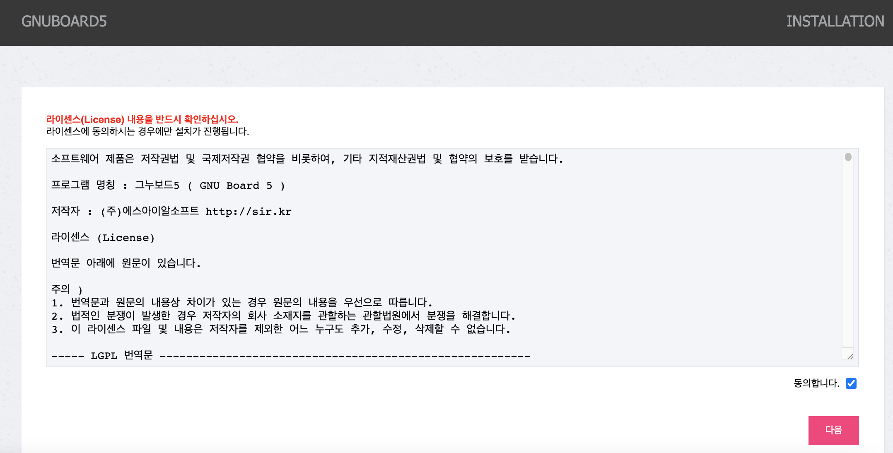

# 3-Tier Architecture

## 1. 3-Tier Architecture

- WEB - WAS(PHP) - DATABASE
- Apache, PHP, MariaDB 연동해서 게시판(그누보드) 만들기
    - 편의를 위해 강의에서는 하나의 서버에 WEB-WAS-DB 모두 구축 (일반적으로는 각 서버를 분리)
    
    
    

## 1. MariaDB 설치

- 데이터베이스를 생성하고 관리하는 시스템
- 데이터베이스 관리 시스템(database management system, DBMS)
- 오픈소스 DBMS: MariaDB
- MariaDB를 설치하고 DB 관리자 패스워드를 설정한다.

```bash
# MariaDB 설치
ttabae@ubuntu:~/lfcs-exam$ sudo -i
[sudo] password for ttabae: 
root@ubuntu:~# apt update
Get:1 http://security.ubuntu.com/ubuntu focal-security InRelease [114 kB]
...(생략)...
root@ubuntu:~# apt install mariadb-server mariadb-client -y
...(생략)...

# MariaDB 서비스 실행확인
root@ubuntu:~# systemctl status mariadb.service 
● mariadb.service - MariaDB 10.3.34 database server
     Loaded: loaded (/lib/systemd/system/mariadb.service; enabled; vendor prese>
     Active: active (running) since Sat 2022-09-24 03:11:19 PDT; 1min 32s ago
       Docs: man:mysqld(8)
             https://mariadb.com/kb/en/library/systemd/
   Main PID: 105248 (mysqld)
     Status: "Taking your SQL requests now..."
      Tasks: 31 (limit: 4583)
     Memory: 63.4M
     CGroup: /system.slice/mariadb.service
             └─105248 /usr/sbin/mysqld

# 최초 실행히 mysql database 관리자(root 사용자)의 패스워드를 설정
root@ubuntu:~# mysqladmin -u root -p password 'pass'
Enter password:<linux_root_password>

# 관리자 비밀번호를 변경했다면 아래 명령어를 이용해 DB에 접근
root@ubuntu:~# mysql -u root -p
Enter password: <pass>
Welcome to the MariaDB monitor.  Commands end with ; or \g.
Your MariaDB connection id is 37
Server version: 10.3.34-MariaDB-0ubuntu0.20.04.1 Ubuntu 20.04

Copyright (c) 2000, 2018, Oracle, MariaDB Corporation Ab and others.

Type 'help;' or '\h' for help. Type '\c' to clear the current input statement.

# 간단한 데이터베이스 목록 실행해보기.
MariaDB [(none)]> show databases;
+--------------------+
| Database           |
+--------------------+
| information_schema |
| mysql              |
| performance_schema |
+--------------------+
3 rows in set (0.003 sec)

# DB 연결 종료
MariaDB [(none)]> exit
Bye
```

## 2. Apache Web Server 설치

- Web Server: NGINX, Apache
- Apache2를 설치하고 서비스 동작해보기.
    
    ```bash
    # 아파치 설치
    root@ubuntu:~# apt install apache2 curl -y
    root@ubuntu:~# systemctl status apache2
    ● apache2.service - The Apache HTTP Server
         Loaded: loaded (/lib/systemd/system/apache2.service; enabled; vendor prese>
         Active: active (running) since Sat 2022-09-24 03:25:17 PDT; 34s ago
           Docs: https://httpd.apache.org/docs/2.4/
       Main PID: 107325 (apache2)
          Tasks: 55 (limit: 4583)
         Memory: 4.9M
         CGroup: /system.slice/apache2.service
                 ├─107325 /usr/sbin/apache2 -k start
                 ├─107326 /usr/sbin/apache2 -k start
                 └─107327 /usr/sbin/apache2 -k start
    
    Sep 24 03:25:16 ubuntu systemd[1]: Starting The Apache HTTP Server...
    Sep 24 03:25:17 ubuntu apachectl[107324]: AH00558: apache2: Could not reliably >
    Sep 24 03:25:17 ubuntu systemd[1]: Started The Apache HTTP Server.
    
    # 간단한 웹페이지 생성 후 웹 서버 동작 확인
    root@ubuntu:~# cd /var/www/html
    root@ubuntu:/var/www/html# cat > index.html 
    Building APM
    (Ctrl + d)
    root@ubuntu:/var/www/html# cd
    root@ubuntu:~# curl localhost
    Building APM
    ```
    
    
    

## 3. PHP 설치

- PHP 설치 후 Apache와 연동되었는지 확인
- Apache → 동적(dynamic) 한 프로그램을 받아줄 수 없음 ⇒ PHP 필요
- PHP는 Apache와 연동되어야 한다: libapache2-mod-php 설치
- PHP와 mysql 연동: php-mysql
- PHP에서 Graphic을 사용: php-gd
    
    ```bash
    root@ubuntu:~# apt install php libapache2-mod-php php-mysql php-gd -y
    
    root@ubuntu:~# cd /var/www/html
    root@ubuntu:/var/www/html# cat > index.php
    <?php phpinfo(); ?>
    (Ctrl + d)
    
    ttabae@ubuntu:~/lfcs-exam$ cd
    ```
    
    - phpinfo() (현재 php 상태를 보여주는 함수) 라는 함수를 동작하도록 작성
- 브라우저에서 테스트 진행
    
    
    

## 4. 그누보드(게시판) 설치

- gnuboard 설치 (sir.kr 사이트 참조)
    
    ```bash
    root@ubuntu:~# wget https://github.com/gnuboard/gnuboard5/archive/5.3.2.0.tar.gz
    
    root@ubuntu:~# tar -zxvf 5.3.2.0.tar.gz
    root@ubuntu:~# ls
    5.3.2.0.tar.gz  gnuboard5-5.3.2.0  snap
    root@ubuntu:~# mv gnuboard5-5.3.2.0 gnuboard
    root@ubuntu:~# ls
    5.3.2.0.tar.gz  gnuboard  snap
    
    root@ubuntu:~# mv gnuboard5-5.3.2.0 gnuboard
    root@ubuntu:~# ls
    5.3.2.0.tar.gz  gnuboard  snap
    root@ubuntu:~# mv gnuboard/ /var/www/html/
    root@ubuntu:~# cd /var/www/html/gnuboard/
    root@ubuntu:/var/www/html/gnuboard# ls
    adm          extend             img          mobile     tail.php
    bbs          g4_import.php      index.php    perms.sh   tail.sub.php
    _common.php  g4_import_run.php  install      plugin     theme
    common.php   _head.php          js           README.md
    config.php   head.php           lib          skin
    css          head.sub.php       LICENSE.txt  _tail.php
    ```
    
    - gnuboard 접속
        
        
        
        - 이후 안내대로 진행
        
        ```bash
        root@ubuntu:/var/www/html/gnuboard# mkdir data
        root@ubuntu:/var/www/html/gnuboard# chmod 707 data
        
        ## + 브라우저 새로고침 ##
        ```
        
        - 브라우저를 새로고침하면 라이선스 동의 페이지로 이동됨 → 동의
        
        

        - mysql 사용자와 그누보드를 연동해야한다. 그 전에  그누보드를 위한 데이터베이스/유저/비밀번호를 생성하자.
            - user: `btcuser`
            - password: `pass`
            - 관리 DB: `gnuboard`
            
            ```bash
            # DB 접속
            root@ubuntu:/var/www/html/gnuboard# mysql -u root -p
            Enter password: 
            Welcome to the MariaDB monitor.  Commands end with ; or \g.
            Your MariaDB connection id is 38
            Server version: 10.3.34-MariaDB-0ubuntu0.20.04.1 Ubuntu 20.04
            
            Copyright (c) 2000, 2018, Oracle, MariaDB Corporation Ab and others.
            
            Type 'help;' or '\h' for help. Type '\c' to clear the current input statement.
            
            # GNU board를 위한 데이터베이스 생성
            MariaDB [(none)]> create database gnuboard;
            Query OK, 1 row affected (0.003 sec)
            MariaDB [(none)]> show databases;
            +--------------------+
            | Database           |
            +--------------------+
            | gnuboard           |
            | information_schema |
            | mysql              |
            | performance_schema |
            +--------------------+
            4 rows in set (0.002 sec)
            
            # GNU board를 위한 관리자 계정 생성
            MariaDB [(none)]> grant all privileges on **gnuboard.*** to **btcuser**@localhost identified by '**pass**';
            Query OK, 0 rows affected (0.011 sec)
            MariaDB [(none)]> exit
            Bye
            ```
            
        - 그누보드에 생성한 DB 정보 입력
            - MySQL 정보 입력 → 위에서 생성한 database와 관리자계정 정보 입력
            - 최고 관리자 정보 입력 - 게시판 관리자 정보
                - admin / pass / admin@domain.com
        - 설정이 완료되면 `새로운 그누보드5로 이동` 버튼 클릭
        - 메인 그누보드 화면에서 위에서 입력한 최고 관리자 정보를 이용해 로그인할 수 있다.
            
            
            
            

<br/>