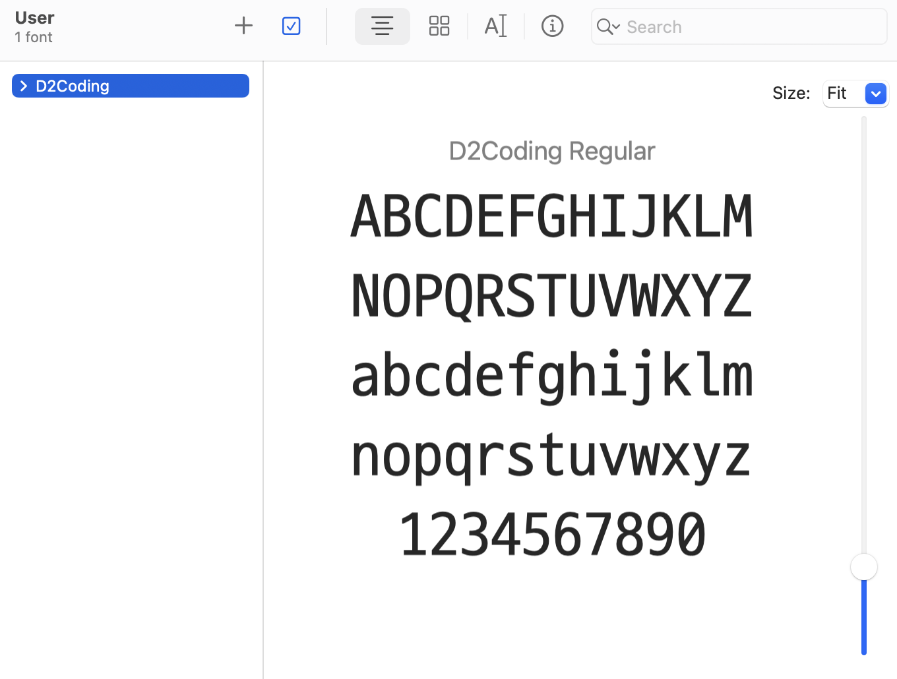
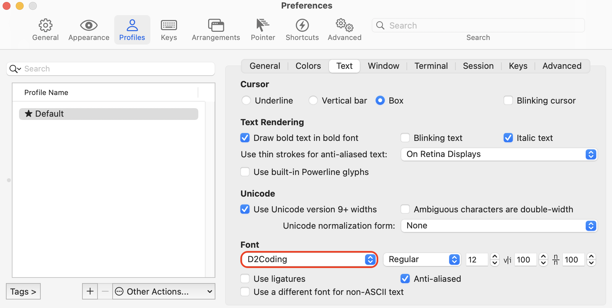
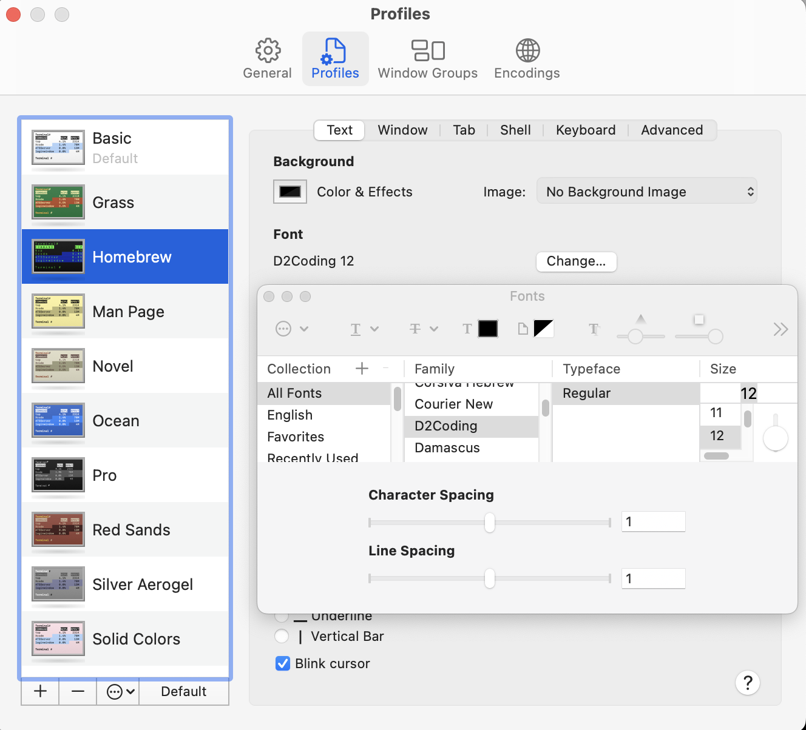

맥북을 아주 오래전에 산 뒤에 iTerm을 세팅해두었었는데, 어떻게 세팅했었는지 기억이 전혀 나지 않아 이번에 M1 Mac북을 사용하게 되면서 새로 iTerm2를 세팅하면서 방법을 정리해두려고 한다.

<br/>

# M1 Mac에서 iTerm2 세팅하기

맥OS에서도 기본 터미널을 제공하지만, 기능이 더 많이 추가 되고 가독성도 좋은 iTerm2를 설치하면 생산성을 높을 수 있다.

<br/>

## iTerm2 다운로드

iTerm을 다운로드 하기 위해서는 [공식 사이트](https://iterm2.com/downloads.html)에서 다운로드 받거나, Homebrew를 설치한 경우 MacOS 패키지 관리자인 Homebrew를 사용해(`brew` 명령어 사용) 다운로드 받을 수도 있다.

```bash
user ~ % brew install --cask iterm2
==> Tapping homebrew/cask
Cloning into '/opt/homebrew/Library/Taps/homebrew/homebrew-cask'...
remote: Enumerating objects: 675236, done.
remote: Counting objects: 100% (165/165), done.
remote: Compressing objects: 100% (104/104), done.
```

<br/>

## oh-my-zsh 설치

여러 편리한 기능을 제공하는 oh-my-zsh를 설치해보도록 하겠다. 참고로 최근 MacOS의 기본 쉘이 bash에서 zsh로 변경되어 터미널에서 zsh를 설치하는 작업은 별도로 필요 없어져서, 바로 아래 명령어를 입력하면 된다.

```bash
sh -c "$(curl -fsSL https://raw.github.com/robbyrussell/oh-my-zsh/master/tools/install.sh)"
```

<br/>

## iTerm2 테마 설정

```bash
➜  ~ vi ~/.zshrc
```

<br/>

```bash
# Set name of the theme to load --- if set to "random", it will
# load a random theme each time oh-my-zsh is loaded, in which case,
# to know which specific one was loaded, run: echo $RANDOM_THEME
# See https://github.com/ohmyzsh/ohmyzsh/wiki/Themes
ZSH_THEME="agnoster"
```

<br/>

## 자동완성 기능 추가

```bash
cd .oh-my-zsh
cd plugins
git clone zsh-autosuggestions
cd ~
이후 홈 디렉토리로 들어가서 vi 편집기로 .zshrc를 실행한다. plugins 부분에 zsh-autosuggestions을 추가한 뒤 저장한다.
```

<br/>

## iTerm2 기능

공식 홈페이지의 [기능(Features)](https://iterm2.com/features.html) 탭에서 iTerm2가 제공하는 기능들을 확인할 수 있다. 

<br/>

화면 분할이나 글씨 컬러링 커스텀도 가능하고, 마우스 없이 키보드로만 복사 붙여넣기를 수행할 수도 있으며, 검색, 자동완성 기능도 제공한다.

<br/>

## iTerm 폰트 설정(D2 Coding)

iTerm 및 맥 기본 터미널에서 폰트 설정을 변경할 수 있는데, 나는 D2 Coding 폰트를 선택했다. 먼저 [이 링크](https://github.com/naver/d2codingfont)에서 D2 Coding 서체 zip파일을 다운받자.

<br/>

압축을 풀어준 뒤, ttf 파일을 더블클릭 > Install 버튼을 클릭해 서체를 설치한다.



<br/>

그 다음으로는 iTerm2의 Profiles > Open profiles > Edit Profiles > Profiles 탭 클릭 > Text 탭 클릭한 뒤 Font를 D2 Coding으로 변경해준다.



<br/>

일반터미널도 마찬가지로 Terminal > Preferences > Profiles에서 Font를 변경해준다.



<br/>

## iTerm2 테마 변경: awesomepanda

다음은 iTerm2의 테마를 변경해보겠다. 테마는 일반적으로 많이 사용하는 agnoster 대신 awesomepanda 선택했는데, 이유는 1) git 브랜치를 명확하게 알 수 있으면서 2) 코드를 복사했을 때 깨지는 부분이 없고 3) 사용자명이 노출되지 않는 테마라 선택하게 되었다(agnoster는 코드를 복붙했을때 깨지는 부분이 있어 블로그 작성 시 불편할 듯 해서 선택하지 않았다). 기타 다양한 테마를 확인하려면 [이 링크](https://github.com/ohmyzsh/ohmyzsh/wiki/Themes)를 참조하자.

<br/>

테마의 설정방법은 간단하다. 먼저 zsh 설정파일을 열어준다.

```bash
vi ~/.zshrc
```

<br/>

설정들 중에서 ZSH_THEME이라고 적혀있는 곳을 찾아 값을 awesomepanda로 변경한다.

```bash
# Set name of the theme to load --- if set to "random", it will
# load a random theme each time oh-my-zsh is loaded, in which case,
# to know which specific one was loaded, run: echo $RANDOM_THEME
# See https://github.com/ohmyzsh/ohmyzsh/wiki/Themes
ZSH_THEME="awesomepanda"
```

<br/>

이제 터미널을 껐다 켜면 테마가 잘 적용이 된 것을 알 수 있다.

```bash
➜  myblog git:(master) ✗
```

<br/>

## iTerm2 컬러 테마 선택하기: Atom

[이 링크](https://iterm2colorschemes.com/)를 들어가서 zip파일을 다운받게 되면 각 테마에 해당하는 .itermcolors 라는 파일이 존재한다. 이 컬러테마를 iTerm2 컬러셋에 import해서 사용할 수 있다.

<br/>

iTerm2 > Preference > Profiles > Colors > Color Presets > Import… 에서 Atom 테마를 import한다. 참고로 다운받은 zip 파일 중에서 .itermcolors 파일을 찾으려면 schemes 폴더로 이동한다.

<br/>

Color Presets에서 Atom 테마를 선택해 변경하면 터미널을 재기동할 필요 없이 바로 컬러 테마가 적용된 것을 알 수 있다.

<br/>

## iTerm2 플러그인 설치: 자동완성, Syntax Highlighter

먼저 자동완성 플러그인([참고 링크](https://github.com/zsh-users/zsh-autosuggestions))을 추가해보자. 자동완성 플러그인은 이전에 사용한 명령어를 추천해주어 자동완성을 할 수 있는 플러그인이다.

<br/>

아래 명령어를 실행해 oh-my-zsh 플러그인 디렉토리로 clone한다.

```bash
➜  myblog git:(master) ✗ git clone https://github.com/zsh-users/zsh-autosuggestions ${ZSH_CUSTOM:-~/.oh-my-zsh/custom}/plugins/zsh-autosuggestions
```

<br/>

다음으로 zsh설정파일에 Syntax Highlighter 플러그인을 추가하자.

```bash
vi ~/.zshrc
```

<br/>

아래와 같이 플러그인 설정에 자동완성 플러그를 추가하자.

```bash
# Which plugins would you like to load?
# Standard plugins can be found in $ZSH/plugins/
# Custom plugins may be added to $ZSH_CUSTOM/plugins/
# Example format: plugins=(rails git textmate ruby lighthouse)
# Add wisely, as too many plugins slow down shell startup.
plugins=(
    git
    # iterm2 plugins
    zsh-autosuggestions
)
```

<br/>

참고로 자동완성 플러그인을 사용하려면 추천 내용을 확인한 뒤 `→` 키보드 방향키를 눌러 적용할 수 있다.

<br/>

Syntax Highlighter 플러그인도 동일한 요령으로 적용할 수 있다. 먼저 git repository에서 플러그인 파일을 다운로드 받는다.

```bash
git clone https://github.com/zsh-users/zsh-syntax-highlighting.git ${ZSH_CUSTOM:-~/.oh-my-zsh/custom}/plugins/zsh-syntax-highlighting
```

<br/>

다음으로 zsh 설정파일에 플러그인을 추가해준다.

```bash
# Which plugins would you like to load?
# Standard plugins can be found in $ZSH/plugins/
# Custom plugins may be added to $ZSH_CUSTOM/plugins/
# Example format: plugins=(rails git textmate ruby lighthouse)
# Add wisely, as too many plugins slow down shell startup.
plugins=(
    git
    # iterm2 plugins
    zsh-autosuggestions
    zsh-syntax-highlighting
)
```

<br/>