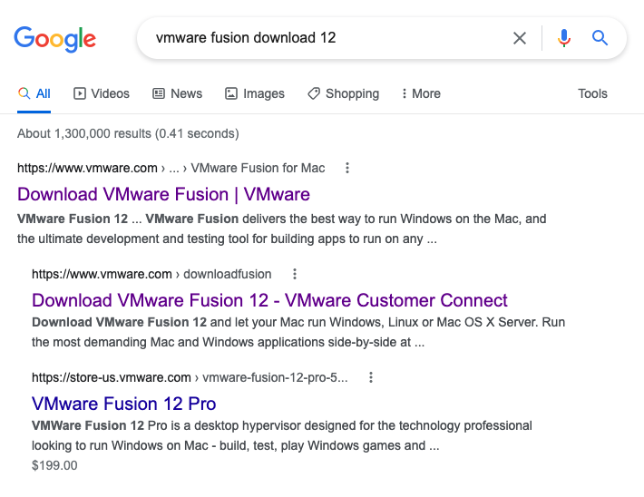
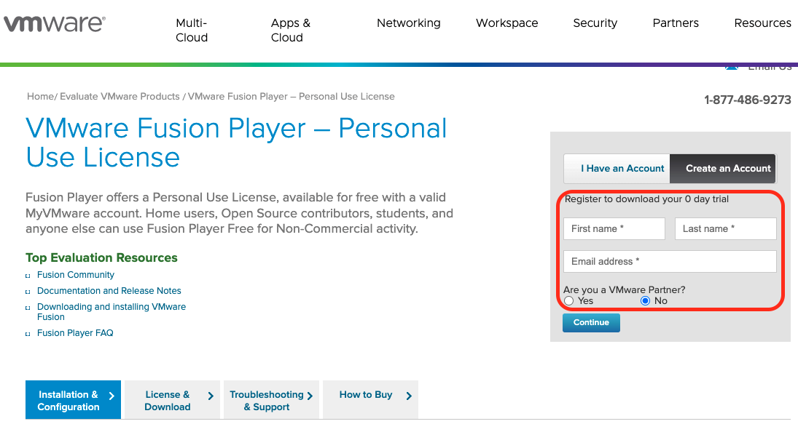
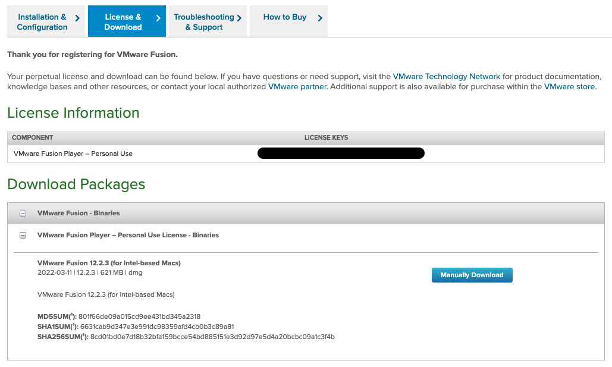
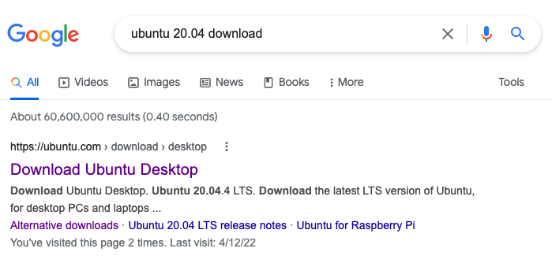
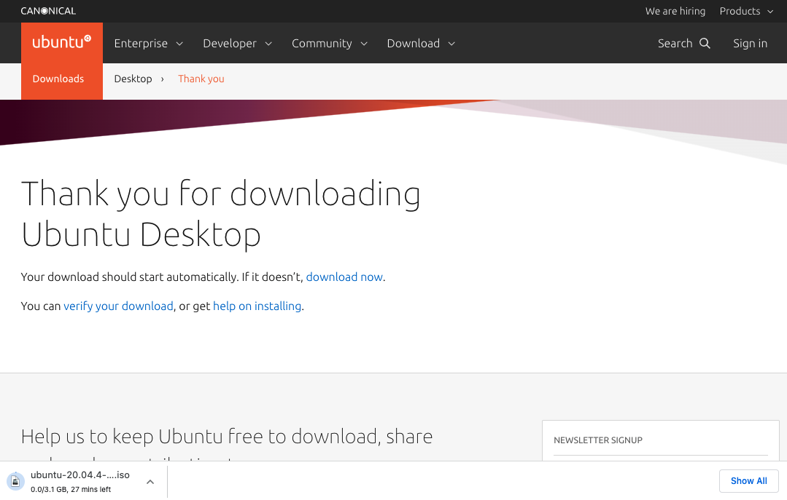
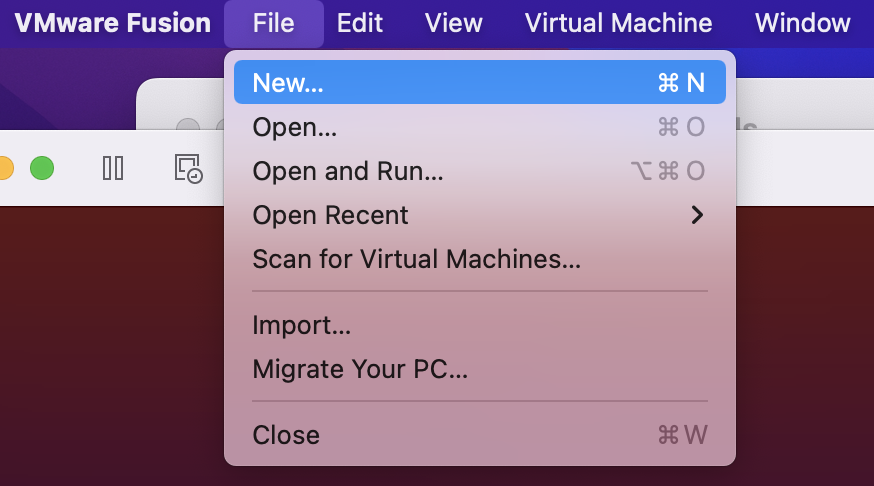
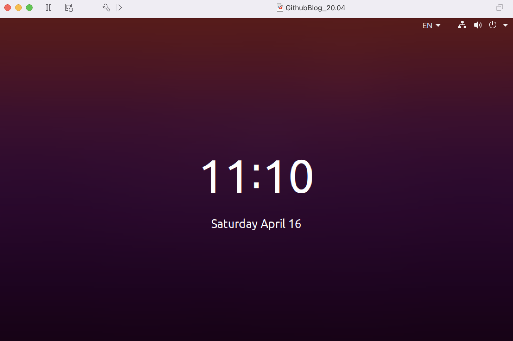

> 💡 MacOS 환경에서 VMware로 Ubuntu를 설치하려면 “VMware Fusion”을 설치해야 한다.

<br/>

이번 포스팅에서는 VMware Fusion에서 Ubuntu 20.04 버전을 설치해보도록 하겠다. 코딩 강의를 수강하거나 스터디 할 때 실습 환경을 맞춰주기 위해서 우분투를 설치했었는데, 이번에는 Jekyll을 설치하기 위해 우분투 환경을 만들어주게 되었다.

<br/>

만약 나와 같이 MacOS(Catalina 이상 버전)에서 Jekyll 설치에 실패했던 사람은 Ubuntu 20.04 버전에서 설치 해보는 걸 추천한다. (참고로 Ubuntu 18.04 버전에서는 Jekyll 설치는 가능했었으나 테마 적용에서 버전 이슈가 발생했다.)

<br/>

그럼 VMware Fusion과 Ubuntu가 무엇인지에 대해 간단하게 살펴본 뒤 두 소프트웨어를 설치해보도록 하자.

<br/>
<br/>

# 1. VMware Fusion이란?

VMware Fusion은 VMware사에서 제공하는 **MacOS 컴퓨터용 가상머신** 소프트웨어이다. 무료버전인 VMware Fusion Player와 유료버전인 VMware Fusion Pro 두 가지 버전을 배포하고 있다.

<br/>

VMware 에서는 VMware Fusion외에도 Windows 환경에서 사용할 수 있는 VMware Workstation이 있으며, VMware Workstation도 Player와 마찬가지로 Player(무료 버전), Pro(유료 버전) 두 가지 버전을 배포하고 있다.

<br/>
<br/>

# 2. 우분투(Ubuntu)란?

우분투(Ubuntu)는 데비안(Debian) GNU/리눅스를 기반으로 만들어진 운영체제로, 남아공 출신의 사업가인 Canonical의 CEO인 마크 셔틀워스(Mark Shuttleworth)에 의해 시작되었다. 우분투라는 제품명도 남아프리카의 반투어에서 따온 것으로, 사람들간의 관계와 헌신에 중점을 둔 윤리 사상, 인본주의에 기반한 아프리카의 전통적 사상이다. 우분투는 이러한 ‘우분투' 정신을 개발 철학으로 삼고 있어 1. 소프트웨어 사용이 무료여야하고, 2. 모든 사람들의 모국어로 사용되어야하며, 3. 장애를 가진 사람도 이용할 수 있어야 한다고 한다. 또한 우분투는 오픈소스 소프트웨어로 **무료로 제공**되며 사람들이 자유롭게 소프트웨어를 수정할 수 있다.

<br/>
<br/>

뿐만 아니라 대부분의 리눅스 배포판들이 서버용으로 사용되고 있는 데 반해, 우분투는 **개인 사용자나 데스크탑 환경에 최적화** 되도록 개발되어 개인 컴퓨터에 리눅스 환경을 구축하고 싶을 때 매우 유용하다.

<br/>
<br/>

# 3. VMware Fusion 설치하기

1. 구글에서 vmware fusion download 12를 검색해 맨 위의 링크로 들어간다.
    
    

<br/>

2. VMware Fusion Player - Personal Use License에 접속해 로그인한다(아이디가 없을 경우 Create an Account 탭을 클릭 ⇒ 빨간 박스 안에 들어간 내용을 입력해 회원가입을 진행한 뒤 로그인한다).
    
    

<br/>

3. 패키지를 다운로드 및 설치한다(License Key가 필요한 경우 다운로드 창 위에 발급된 라이선스 키를 사용한다).
    
    

<br/>

# 4. Ubuntu 20.04 버전 설치하기

1. 구글에서 “Ubuntu 20.04 download”를 검색해 우분투 공식 웹사이트 링크로 접속한다.
    
    

<br/>

2. 다운로드를 클릭한다.
    
    

<br/>

3. iso 파일을 다운로드 받는다.
    
    

<br/>

4. VMware Fusion을 구동한 뒤, File > New를 클릭한다.
    
    

<br/>

5. Install from disc or image에 다운로드 받은 iso파일을 드래그앤드롭 한다.
    
    

<br/>

6. ubuntu-20.04버전이 선택된 것을 확인 한 뒤 Continue 클릭한다.
    
    

<br/>

7. 계정명과 비밀번호를 입력한 뒤 Continue 버튼을 클릭한다.
    
    

<br/>

8. 내용을 확인한 뒤 Finish를 클릭한다(만일 생성되는 머신의 이름을 변경하고 싶은 경우 Customize Settings를 클릭해 이름을 변경해준다).
    
    

<br/>   

9. 설치가 완료되면 화면을 더블클릭해 활성화 한 뒤 설정한 비밀번호를 입력한 후 접속할 수 있다.
    
    

<br/>

이렇게 MacOS 환경에서 VMware Fusion을 이용해 Ubuntu20.04 환경을 구성해보았다. 다음 포스팅에서는 Ubuntu 환경 위에서 Jekyll을 설치한 뒤, Github Pages(깃허브 블로그)를 생성해보도록 하자.

<br/>

```toc
```